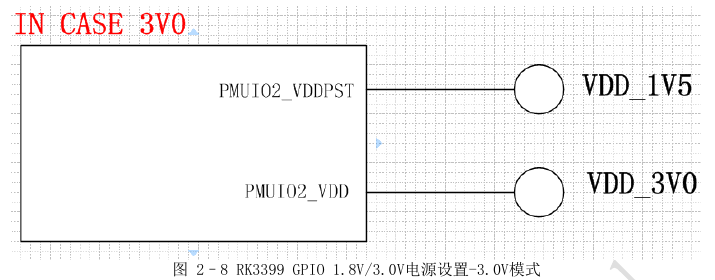
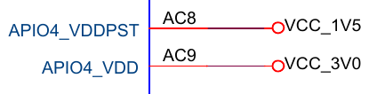

# Firefly_RK3399

## 编译脚本参考gen_star

[RK3399编译脚本](https://github.com/54shady/gen_star/tree/rk3399)

## 驱动开发

[代码编译方法(具体可参考Makefile中的注释)](https://github.com/54shady/kernel_drivers_examples)

[SPI驱动开发](./debug/spi)

[USB驱动和应用开发](./debug/usb)

[UART驱动开发](./debug/uart)

[I2C驱动开发](./debug/i2c)

[Regmap 驱动实例](./debug/regmap)

[SD/MMC](./debug/mmc)

[字符设备驱动](./debug/char)

[GPIO操作实例](./debug/platform_driver_test)

## 应用开发

[LCD应用编程](./apps)
## Uboot中驱动开发

[GPIO驱动](./uboot)

## 烧写

### 分区和对应文件

Linux系统

|分区编号|分区名|镜像文件名|
|--|--|--
|mmcblk1p1|uboot|uboot.img
|mmcblk1p2|trust|trust.img
|mmcblk1p3|boot|linux_boot.img
|mmcblk1p4|backup|
|mmcblk1p5|linuxroot|linuxroot.img

parameter里分区如下

	mtdparts=rk29xxnand:0x00002000@0x00002000(uboot),0x00002000@0x00004000(trust),0x00010000@0x00006000(boot),0x00002000@0x00016000(backup),-@0x00018000(linuxroot)

Android系统

|分区编号|分区名|镜像文件名|
|--|--|--
|mmcblk1p1|uboot|uboot.img
|mmcblk1p2|trust|trust.img
|mmcblk1p3|misc|misc.img
|mmcblk1p4|resource|resource.img
|mmcblk1p5|kernel|kernel.img
|mmcblk1p6|boot|boot.img
|mmcblk1p7|recovery|recovery.img
|mmcblk1p8|backup|
|mmcblk1p9|cache|
|mmcblk1p10|system|system.img
|mmcblk1p11|metadata|
|mmcblk1p12|baseparamer|
|mmcblk1p13|userdata|

parameter里分区如下

	mtdparts=rk29xxnand:0x00002000@0x00002000(uboot),0x00002000@0x00004000(trust),0x00002000@0x00006000(misc),0x00008000@0x00008000(resource),0x0000A000@0x00010000(kernel),0x00010000@0x0001A000(boot),0x00010000@0x0002A000(recovery),0x00038000@0x0003A000(backup),0x00040000@0x00072000(cache),0x00200000@0x000B2000(system),0x00008000@0x002B2000(metadata),0x00002000@0x002BA000(baseparamer),-@0x002BC000(userdata)

### 使用upgrade_tool烧写

	upgrade_tool ul RK3399MiniLoaderAll_V1.05.bin
	upgrade_tool di uboot uboot.img
	upgrade_tool di trust trust.img
	upgrade_tool rd

### 使用rkflashtool烧写(nsector = 512byte)

[rkflashtool for rk3399下载地址](https://github.com/54shady/rkflashtool)

参考rkflashtool帮助

读出misc分区(假设起始地址为0x6000)前48K的内容

	rkflashtool r 0x6000 96 > misc.img

## GPIO类型

如何确定开发板上调试串口电平是3.0v还是1.8v的


硬件原理图连接如下


TX和RX是从主控AJ4,AK2连出来的


AJ4和AK2所在的电源域(GPIO类型)为APIO4


APIO4电源域如下图(可以根据硬件电路来配置是1.8v/3.0v)


电源设置1.8v模式硬件电路


电源设置3.0v模式硬件电路



查看开发板原理图如下(所以是3.0v)



## LED使用

Firefly-RK3399开发板上有2个LED灯,如下表所示

|LED|GPIO|PIN NUMBER|
|---|---|---
|Blue|GPIO2_D3|91
|Yellow|GPIO0_B5|13

### 以设备(LED子系统)的方式控制LED

	echo 0 > /sys/class/leds/firefly:blue:power/brightness
	echo 1 > /sys/class/leds/firefly:blue:power/brightness

### 使用trigger方式控制LED(参考leds-class.txt)

首先在DT里将两个LED描述如下

```c
leds {
   compatible = "gpio-leds";
   power {
	   label = "firefly:blue:power";
	   linux,default-trigger = "ir-power-click";
	   default-state = "on";
	   gpios = <&gpio2 D3 GPIO_ACTIVE_HIGH>;
	   pinctrl-names = "default";
	   pinctrl-0 = <&led_power>;
   };
   user {
	   label = "firefly:yellow:user";
	   linux,default-trigger = "ir-user-click";
	   default-state = "off";
	   gpios = <&gpio0 B5 GPIO_ACTIVE_HIGH>;
	   pinctrl-names = "default";
	   pinctrl-0 = <&led_user>;
   };
};
```

#### Simple trigger LED

1. 定义LED触发器

	DEFINE_LED_TRIGGER(ledtrig_default_control);

2. 注册该触发器

	led_trigger_register_simple("ir-user-click", &ledtrig_default_control);

3. 控制LED的亮

	led_trigger_event(ledtrig_default_control, LED_FULL);

#### Complex trigger LED

查看都支持那些trigger

	cat /sys/class/leds/firefly\:blue\:power/trigger

使用某个trigger触发

	echo "timer" > /sys/class/leds/firefly\:blue\:power/trigger

## GPIO使用(以GPIO0_B4为例)

DT里描述GPIO0_B4如下

配置管脚MUX为GPIO模式(默认是GPIO模式,这里是为了读者更明白原理)
```c
gpio_demo_pin: gpio_demo_pin {
	rockchip,pins = <GPIO0_B4 RK_FUNC_GPIO &pcfg_pull_none>;
};
```

以GPIO的模式使用该PIN脚
```c
gpio_demo: gpio_demo {
	status = "okay";
	compatible = "firefly,rk3399-gpio";
	firefly-gpio = <&gpio0 B4 GPIO_ACTIVE_HIGH>;
	pinctrl-names = "default";
	pinctrl-0 = <&gpio_demo_pin>;
};
```

### IO-Domain
在复杂的片上系统(SOC)中,设计者一般会将系统的供电分为多个独立的block,这称作电源域(Power Domain),这样做有很多好处,例如:

- 在IO-Domain的DTS节点统一配置电压域,不需要每个驱动都去配置一次,便于管理
- 依照的是Upstream的做法,以后如果需要Upstream比较方便
- IO-Domain的驱动支持运行过程中动态调整电压域,例如PMIC的某个Regulator可以1.8v和3.3v的动态切换,一旦Regulator电压发生改变,会通知IO-Domain驱动去重新设置电压域

### 使用工具IO来调试

查看GPIO1_B3引脚的复用情况

1. 从主控的datasheet查到GPIO1对应寄存器基地址为:0xff320000
2. 从主控的datasheet查到GPIO1B_IOMUX的偏移量为:0x00014
3. GPIO1_B3的iomux寄存器地址为:基址(Operational Base) + 偏移量(offset)=0xff320000+0x00014=0xff320014
4. 用以下指令查看GPIO1_B3的复用情况:

	io -4 -r 0xff320014
	ff320014:  0000816a

5. 如果想复用为GPIO,可以使用以下指令设置

	io -4 -w 0xff320014 0x0000812a

## 使用Linaro编译器编译(android和linux都验证通过)

[gcc-linaro-4.9.4-2017.01-i686_aarch64-linux-gnu.tar.xz下载地址](http://releases.linaro.org/components/toolchain/binaries/4.9-2017.01/aarch64-linux-gnu/)

修改对应的gen脚本里的LOCAL_CROSS_COMPILE为指定的编译器即可

### 编译u-boot

烧写u-boot

	upgrade_tool di uboot uboot.img
	upgrade_tool di trust trust.img
	upgrade_tool ul RK3399MiniLoaderAll_V1.05.bin

进入uboot后查看是否是新编译器编译的,执行下面命令

	version

结果中能看到如下信息

	U-Boot 2014.10-RK3399-10 (Mar 30 2017 - 00:42:40)
	aarch64-linux-gnu-gcc (Linaro GCC 4.9-2017.01) 4.9.4
	GNU ld (Linaro_Binutils-2017.01) 2.24.0.20141017 Linaro 2014_11-3-git

### 编译kernel

烧写kernel

	upgrade_tool di -k kernel.img
	upgrade_tool di resource resource.img

查编译内核的编译器版本

	cat /proc/version

结果中能看到如下信息

	Linux version 4.4.16 (gcc version 4.9.4 (Linaro GCC 4.9-2017.01) )

### 编译ramdisk(busybox-1.22.0)

修改busybox源码中的xconnect.c解决ping bad addr bug

[参考文章](http://hankjin.blog.163.com/blog/static/337319372009327101324432/)

设置交叉编译工具和安装路径等(参考rk3399_busybox_defconfig)

	Build BusyBox as a static binary (no shared libs)

可以在.config中直接设置

	CONFIG_PREFIX="/home/zeroway/rk3399/bsp/ramdiskfs"
	CONFIG_CROSS_COMPILER_PREFIX="/home/zeroway/rk3399/tool/gcc-linaro-4.9.4-2017.01-i686_aarch64-linux-gnu/bin/aarch64-linux-gnu-"

编译安装

	make
	make install

经过上一步已经将busybox安装到ramdiskfs文件夹中,有如下内容(linuxrc是指向busybox的链接)

	bin  linuxrc  sbin  usr

继续在ramdiskfs目录中创建必要的目录结构

	mkdir var tmp sys root proc opt mnt lib home etc dev

再在etc下创建一个init.d的目录用于保存一些初始化的脚本

	mkdir etc/init.d
	touch etc/init.d/rcS

rcS脚本如下

	mount -a
	mkdir /dev/pts
	mount -t devpts devpts /dev/pts
	echo /sbin/mdev > /proc/sys/kernel/hotplug
	/sbin/mdev -s

给rcS脚本添加可执行权限

	chmod +x etc/init.d/rcS

创建sysconfig

	mkdir etc/sysconfig
	echo "rk3399" > etc/sysconfig/HOSTNAME

添加/etc/fstab内容如下

	proc		/proc			proc		defaults	0			0
	tmpfs		/tmp			tmpfs		defaults	0			0
	sysfs		/sys			sysfs		defaults	0			0
	tmpfs		/dev			tmpfs		defaults	0			0

添加必要的设备节点

	sudo mknod dev/console c 5 1
	sudo mknod dev/null c 1 3

添加/etc/inittab内容如下

	::sysinit:/etc/init.d/rcS
	console::askfirst:-/bin/sh
	::ctrlaltdel:/sbin/reboot
	::shutdown:/bin/umount -a -r

添加/etc/profile内容如下

	ulimit -S -c 0 > /dev/null 2>&1
	USER="`id -un`"
	LOGNAME=$USER
	PS1='[\u@\h \W]\# '
	PATH=$PATH:/usr/local/bin
	HOSTNAME=`/bin/hostname`
	export USER LOGNAME PS1 PATH

添加/etc/passwd内容如下

	root:x:0:0:root:/:/bin/sh
	ftp::14:50:FTP User:/var/ftp:
	bin:*:1:1:bin:/bin:
	daemon:*:2:2:daemon:/sbin:
	nobody:*:99:99:Nobody:/:

添加/etc/group内容如下

	root:*:0:
	daemon:*:1:
	bin:*:2:
	sys:*:3:
	adm:*:4:
	tty:*:5:
	disk:*:6:
	lp:*:7:lp
	mail:*:8:
	news:*:9:
	uucp:*:10:
	proxy:*:13:
	kmem:*:15:
	dialout:*:20:
	fax:*:21:
	voice:*:22:
	cdrom:*:24:
	floppy:*:25:
	tape:*:26:
	sudo:*:27:
	audio:*:29:
	ppp:x:99:

修改[cmdline](./cmdline_android)参数如下(主要修改init=/linuxrc)

	CMDLINE: androidboot.baseband=N/A androidboot.selinux=disabled androidboot.hardware=rk30board androidboot.console=ttyFIQ0 init=/linuxrc mtdparts=rk29xxnand:0x00002000@0x00002000(uboot),0x00002000@0x00004000(trust),0x00002000@0x00006000(misc),0x00008000@0x00008000(resource),0x0000A000@0x00010000(kernel),0x00010000@0x0001A000(boot),0x00010000@0x0002A000(recovery),0x00038000@0x0003A000(backup),0x00040000@0x00072000(cache),0x00200000@0x000B2000(system),0x00008000@0x002B2000(metadata),0x00002000@0x002BA000(baseparamer),-@0x002BC000(userdata)


制作一个大小位8M的ext2格式镜像文件,并挂载到/mnt/initrd目录下
拷贝ramdiskfs里所有文件到/mnt/initrd下

	dd if=/dev/zero of=initrd.img bs=1k count=8192
	sudo mkfs.ext2 -F initrd.img
	sudo mkdir /mnt/initrd
	sudo mount -t ext2 -o loop initrd.img /mnt/initrd
	sudo cp -rfvd ramdiskfs/* /mnt/initrd
	sudo umount /mnt/initrd
	gzip --best -c initrd.img > ramdisk.img
	sudo chmod 777 ramdisk.img

使用RK提供的打包工具将ramdisk打包成boot

	rkst/mkkrnlimg ramdisk.img boot.img

烧写ramdisk镜像

	rkflashtool w boot < boot.img

上网设置(配置网卡,设置域名服务和默认网关)

	ifconfig eth0 192.168.1.234 up
	echo "nameserver 192.168.1.1" > /etc/resolv.conf
	route add default gw 192.168.1.1

## linux_boot.img制作

编译内核得到Image和resource.img

ramdisk镜像制作

	git clone https://github.com/54shady/firefly_rk3399_ramdisk
	cd firefly_rk3399_ramdisk
	find . | cpio -o -H newc | gzip > ../ramdisk.cpio.gz

打包成linux_boot.img

	mkbootimg --kernel Image --ramdisk ramdisk_linux.cpio.gz --second resource.img -o linux_boot.img

## Linux发行版根文件系统制作

### Gentoo根文件系统制作(在PC主机上操作)

[参考文章Crossdev qemu-static-user-chroot](https://wiki.gentoo.org/wiki/Crossdev_qemu-static-user-chroot)

[参考文章Gentoo Arm in a QEmu Chroot](https://cqlug.linux.org.au//node/19)

[下载QEMU user mode emulation binaries](https://launchpad.net/ubuntu/trusty/+package/qemu-user-static)

[下载stage3-arm64-arm64-20170223.tar.bz2](http://gentoo.osuosl.org/experimental/arm/arm64/)

#### 准备stage3

解压stage3到本地目录temp

	mkdir temp
	sudo tar jxvf stage3-arm64-arm64-20170223.tar.bz2 -C temp

#### Qemu for chroot(gentoo user only)

安装alien

	emerge alien

解压deb,得到qemu-user-static-2.0.0~rc1+dfsg.tgz

	alien -t qemu-user-static_2.0.0~rc1+dfsg-0ubuntu3_amd64.deb

解压qemu-user-static-2.0.0~rc1+dfsg.tgz得到qemu-aarch64-static

	sudo cp qemu-aarch64-static /usr/bin/qemu-aarch64
	sudo cp /usr/bin/qemu-aarch64 temp/usb/bin/qemu-aarch64

安装app-emulation/qemu-user为了获得脚本(用的是overlay安装)

	emerge app-emulation/qemu-user

执行脚本(确保aarch64的执行正确, /usr/bin/qemu-arm如果存在会导致失败,删除即可)

	sudo /etc/init.d/qemu-binfmt start

到这里就可以执行chroot了

	sudo chroot temp

#### 基本配置

拷贝DNS信息

	cp -L /etc/resolv.conf temp/etc/

#### 制作文件系统

[可以完全参考mygentoo,此处不详细描述](https://github.com/54shady/mygentoo)

挂载必要目录

	mount -t proc proc temp/proc
	mount --rbind /sys temp/sys
	mount --make-rslave temp/sys
	mount --rbind /dev temp/dev
	mount --make-rslave temp/dev

	chroot temp

### Ubuntu根文件系统制作(在PC主机上操作)

#### 准备ubuntu base

解压ubuntu core到本地目录temp

	mkdir temp
	sudo tar xzvf ubuntu-base-16.04.1-base-arm64.tar.gz -C temp

#### 基本配置

拷贝DNS信息

	cp -L /etc/resolv.conf temp/etc/resolv.conf

Qemu static user

	sudo cp /usr/bin/qemu-aarch64 temp/usr/bin/

到这里就可以执行chroot了

	sudo chroot temp

设置主机名(不设置sudo会有问题)

	echo"rk3399" > /etc/hostname

设置主机入口IP(hosts中要包含hostname)

	echo "127.0.0.1 localhost" >> /etc/hosts
	echo "127.0.1.1 rk3399" >> /etc/hosts

#### 制作文件系统

进入根文件系统进行操作

	sudo chroot temp

更新及安装必要软件

	apt update
	apt-get install console-setup iputils-ping sudo vim net-tools
	ssh software-properties-common

其中console-setup encoding选的是utf-8(该软件不安装串口无法输入)
这里并不需要/etc/init/目录下有类似ttyFIQ0.conf的文件

添加用户

	useradd -s '/bin/bash' -m -G adm,sudo zeroway

给用户设置密码

	passwd zeroway

修改/etc/sudoers

	zeroway    ALL=(ALL:ALL) ALL

设置分区信息(/etc/fstab,推荐这种方法)

	/dev/mmcblk0p5  /  ext4      defaults,noatime,errors=remount-ro   0      1

或者用下面这种

	ln -fs /proc/self/mounts /etc/mtab

#### ubuntu 应用

安装aria2

	add-apt-repository ppa:t-tujikawa/ppa
	apt-get update
	apt-get install aria2

### Arch根文件系统制作(在PC主机上操作)

[下载ArchLinuxARM-aarch64-latest.tar.gz](http://sg.mirror.archlinuxarm.org/os/ArchLinuxARM-aarch64-latest.tar.gz)

解压到本地

	mkdir temp
	sudo tar xzvf ArchLinuxARM-aarch64-latest.tar.gz -C temp/

Qemu static user

	sudo cp /usr/bin/qemu-aarch64 temp/usr/bin/

到这里就可以执行chroot了

	sudo chroot temp

设置用户和密码

	useradd -m -s /bin/bash zeroway
	passwd zeroway

设置主机名

	echo"rk3399" > /etc/hostname

修改支持开发板默认串口

	cp /lib/systemd/system/serial-getty\@.service /lib/systemd/system/serial-getty@ttyFIQ0.service

把里面的"%i.device"改为"%i"

设置开机启动服务

	systemctl enable serial-getty@ttyFIQ0.service

修改源(/etc/pacman.d/mirrorlist)

	Server = http://mirrors.ustc.edu.cn/archlinuxarm/$arch/$repo
	Server = http://mirrors.tuna.tsinghua.edu.cn/archlinuxarm/$arch/$repo
	Server = http://mirrors.stuhome.net/archlinuxarm/$arch/$repo

设置到这里就可以制作成镜像烧写,烧写开机后切换到root用户,默认root密码为root

#### 安装桌面

更新软件源

	pacman -Syu

安装X Window

	pacman -S xorg-server
	pacman -S xorg-twm xorg-xclock xterm
	pacman -S xorg
	pacman -S xorg-xinit

测试是否安装成功

	startx

安装slim和xfce4

	pacman -S slim
	pacman -S xfce4

测试是否安装成功

	startxfce4

#### wifi使用

拷贝下面的固件到/lib/firmware目录下

	fw_bcm4356a2_ag.bin
	nvram_ap6356s.txt

使用ssid和密码生成配置文件

	wpa_passphrase yourssid yourpassphrase > /etc/wpa_supplicant.conf

在配置文件最顶部添加下面内容

	ctrl_interface=DIR=/var/run/wpa_supplicant GROUP=wheel

确保有相应的目录

	mkdir -p /var/run/wpa_supplicant

启动wpa_supplicant

	wpa_supplicant -B -Dnl80211 -i wlan0 -c /etc/wpa_supplicant.conf

使用DHCP获得IP地址后即可上网

	dhcpcd wlan0

## 将根文件系统制作成镜像

这里制作一个8G的ext4格式的镜像文件

	dd if=/dev/zero of=linuxroot.img bs=1M count=8192
	sudo  mkfs.ext4  linuxroot.img
	mkdir  rootfs
	sudo mount linuxroot.img rootfs/
	sudo cp -rfp temp/*  rootfs/
	sudo umount rootfs/
	e2fsck -p -f linuxroot.img
	resize2fs  -M linuxroot.img

烧写制作好的文件系统镜像

	rkflashtool w linuxroot < linuxroot.img

开机进入系统在系统正确加载后执行扩展文件系统命令(这里的mmcblk1p5对应的linuxroot分区)

	 resize2fs /dev/mmcblk1p5

## 解包和打包

[rk3399 ramdisk下载地址](https://github.com/54shady/firefly_rk3399_ramdisk)

[参考文章android boot.img unpack pack](http://www.cnblogs.com/helloworldtoyou/p/6473661.html)

[参考文章Boot.img tools unpack, repack, ramdisk](https://forum.xda-developers.com/showthread.php?t=2319018)

工具源码下载

	git clone https://github.com/neo-technologies/rockchip-mkbootimg.git
	cd rockchip-mkbootimg
	make

打包boot

	mkbootimg --kernel Image --ramdisk ramdisk_linux.cpio.gz --second resource.img -o linux_boot.img

解包boot

	unmkbootimg -i linux_boot.img

解包ramdisk到当前目录

	gzip -d ramdisk_linux.cpio.gz
	cpio -idmv < ramdisk_linux.cpio

打包当前目录到ramdisk.cpio.gz

	find . | cpio -o -H newc | gzip > ../ramdisk.cpio.gz

## Misc

### pincontrl,gpio修改

DT里rockchip,pins描述(写的不易读,使用下面提供的脚本批量修改)

	rockchip,pins = <4 17 RK_FUNC_3 &pcfg_pull_none>
	4 GPIO bank号,从1开始
	17 GPIO offset,从0开始(A0-A7,B0-B7,C0-C7)
	RK_FUNC_3 GPIO mux功能
	pcfg_pull_none GPIO是否上下拉,高阻配置

- 使用脚本replace_gpio.sh修改DT里的GPIO使代码可读性更强(修改OFFSET为宏)

```shell
GPIO_OFFSET=(
A0 A1 A2 A3 A4 A5 A6 A7
B0 B1 B2 B3 B4 B5 B6 B7
C0 C1 C2 C3 C4 C5 C6 C7
D0 D1 D2 D3 D4 D5 D6 D7)

for (( offset = 31; offset >= 0; offset-- ))
do
	sed -i "/&gpio/s/\ $offset/\ ${GPIO_OFFSET[offset]}/g" $1
done
```

代码修改前

	gpio = <&gpio1 0 GPIO_ACTIVE_HIGH>;

代码修改后

	gpio = <&gpio1 A0 GPIO_ACTIVE_HIGH>;


- 使用脚本replace_pin.sh修改DT里的PIN使代码可读性更强(修改该为BANK_OFFSET宏)

```shell
GPIO_OFFSET=(
A0 A1 A2 A3 A4 A5 A6 A7
B0 B1 B2 B3 B4 B5 B6 B7
C0 C1 C2 C3 C4 C5 C6 C7
D0 D1 D2 D3 D4 D5 D6 D7)

for (( offset = 31; offset >= 0; offset-- ))
do
	for (( bank = 4;  bank >= 0; bank-- ))
	do
		sed -i "/RK_FUNC_/s/<$bank $offset/<GPIO${bank}_${GPIO_OFFSET[offset]}/g" $1
	done
done
```

代码修改前

	rockchip,pins = <4 24 RK_FUNC_1 &pcfg_pull_none>;

代码修改后

	rockchip,pins = <GPIO4_D0 RK_FUNC_1 &pcfg_pull_none>;

### 使用7yuv显示fb里的图像

抓取fb里的图像数据

	echo bmp > /sys/class/graphics/fb0/dump_buf

会在/data/dmp_buf/里保存图片数据,假设名为frame0_win0_0_1920x1080_XBGR888.bin

使用7yuv设置好分辨率1920x1080和格式RGBA888就能显示该图片

### 编译时出现"缺少libtinfo.so.5解决办法"

	ln -s /lib/libncurses.so.5 /lib/libtinfo.so.5
