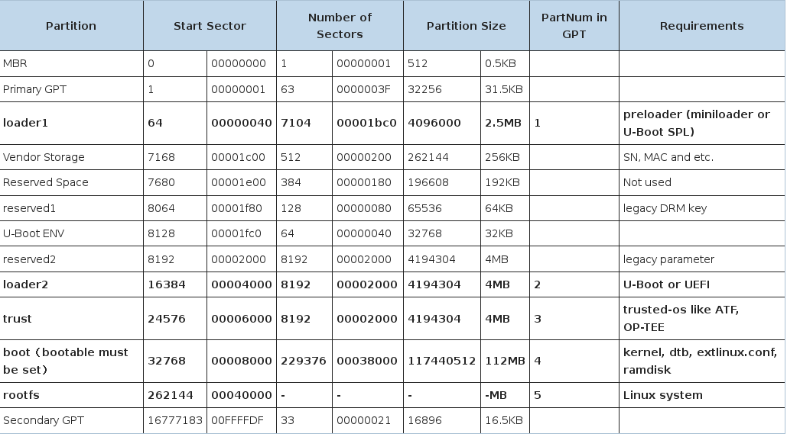

# BSP for Firefly_RK3399

## 分区表

更新分区表方法1(烧写分区表文件)

	rkdeveloptool db rk3399_loader_v1.08.106.bin
	rkdeveloptool gpt parameter_gpt.txt

parameter_gpt.txt内容如下

	CMDLINE:
	mtdparts=rk29xxnand:0x00001f40@0x00000040(loader1),0x00000080@0x00001f80(reserved1),0x00002000@0x00002000(reserved2),0x00002000@0x00004000(loader2),0x00002000@0x00006000(atf),0x00038000@0x00008000(boot:bootable),-@0x0040000(rootfs)

更新分区表方法2(uboot中操作)

	=> env set partitions name=rootfs,size=-,type=system
	=> gpt write mmc 0 $partitions

更新分区表方法3(fastboot烧写,参考官网)

## U-Boot 2017.09

使用ROCKCHIP官方代码

	mkdir rk-linux
	cd rk-linux

	repo init --repo-url=https://github.com/rockchip-linux/repo -u https://github.com/rockchip-linux/manifests -b master
	repo sync

编译Uboot

	build/mk-uboot.sh rk3399-firefly

或者使用54shady的代码

[Firefly_RK3399_UBOOT_Usage](https://github.com/54shady/firefly_rk3399_uboot)

## Kernel (4.4.16)

获取代码

	git clone https://github.com/54shady/firefly_rk3399_kernel.git

编译出Image和dtb

	./mk-kernel.sh

## Rootfs

	ROCKCHIP官方提供的linaro-rootfs.img即可,或是自己制作

## Flash Image

使用rkdeveloptool烧写所有镜像

	rkdeveloptool db rk3399_loader_v1.08.106.bin
	rkdeveloptool wl 0x40 idbloader.img
	rkdeveloptool wl 0x4000 uboot.img
	rkdeveloptool wl 0x6000 trust.img
	rkdeveloptool wl 0x8000 boot.img
	rkdeveloptool wl 0x40000 linaro-rootfs.img
	rkdeveloptool rd

进入uboot后,写入gpt

	gpt write mmc 0 $partitions

文件build/extlinux/rk3399.conf内容如下

	label kernel-4.4
		kernel /Image
		fdt /rk3399-firefly-linux.dtb
		append  earlyprintk console=ttyFIQ0,115200 rw root=PARTUUID=b921b045-1d rootfstype=ext4 init=/sbin/init rootwait
