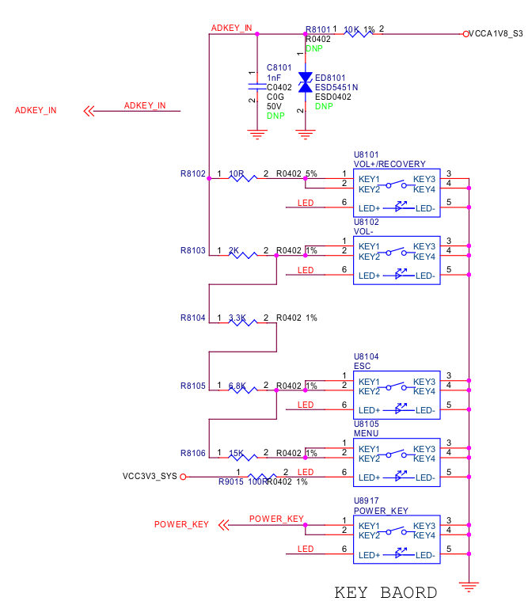

# ADC

## SAR-ADC(RK3399中有6路10位SARADC)

The ADC is a 6-channel signal-ended 10-bit Successive Approximation Register (SAR) A/D Converter

下面是sapphire-excavator开发板上硬件连接情况

设备树中的配置如下

    adc-keys {
        compatible = "adc-keys";
        io-channels = <&saradc 1>;
        io-channel-names = "buttons";
        poll-interval = <100>;
        keyup-threshold-microvolt = <1800000>;

        menu {
            label = "Menu";
            linux,code = <KEY_MENU>;
            press-threshold-microvolt = <1314000>;
        };

        esc {
            label = "Esc";
            linux,code = <KEY_ESC>;
            press-threshold-microvolt = <985000>;
        };

        volume-down {
            label = "Volume Down";
            linux,code = <KEY_VOLUMEDOWN>;
            press-threshold-microvolt = <300000>;
        };

        volume-up {
            label = "Volume Up";
            linux,code = <KEY_VOLUMEUP>;
            press-threshold-microvolt = <100000>;
        };

    };

计算公式

	ADKEY_IN前端电阻R_ADKY_IN
	ADKEY_IN后端电阻(这里图中是10k上拉)

	分压值 = (R_ADKY_IN / (R_ADKY_IN + 10)) * 总(上拉)电压
	adc值 = 分压*2^n (n为采样深度,这里是10bit)

volume-down(串联2K电阻,如上图)

	2/(2+10) * 1.8v = 0.3v

volume-up

	只要电压大于0即可

esc

	(6.8+3.3+2)/(6.8+3.3+2+10) * 1.8v = 0.985v

menu

	(15+6.8+3.3+2)/(15+6.8+3.3+2+10) * 1.8v = 1.314v

## 调试方法

直接获取ADC采样电压值

	io-channels = <&saradc 1>;//对应通道1
	cd /sys/bus/iio/devices/iio:device0
	while true;do cat in_voltage1_raw ;done
	按下按键就能读取分压值

使用evtest来读取按键信息

	[root@rk3399:/]# evtest
	No device specified, trying to scan all of /dev/input/event*
	Available devices:
	/dev/input/event0:      gsl3673
	/dev/input/event1:      adc-keys
	/dev/input/event2:      gpio-keys
	Select the device event number [0-2]: 1
	Input driver version is 1.0.1
	Input device ID: bus 0x19 vendor 0x1 product 0x1 version 0x100
	Input device name: "adc-keys"
	Supported events:
	  Event type 0 (EV_SYN)
	  Event type 1 (EV_KEY)
		Event code 1 (KEY_ESC)
		Event code 114 (KEY_VOLUMEDOWN)
		Event code 115 (KEY_VOLUMEUP)
		Event code 139 (KEY_MENU)
	Properties:
	Testing ... (interrupt to exit)
	Event: time 1358506009.203493, type 1 (EV_KEY), code 139 (KEY_MENU), value 1
	Event: time 1358506009.203493, -------------- SYN_REPORT ------------
	Event: time 1358506009.304471, type 1 (EV_KEY), code 139 (KEY_MENU), value 0
	Event: time 1358506009.304471, -------------- SYN_REPORT ------------
	Event: time 1358506009.704299, type 1 (EV_KEY), code 1 (KEY_ESC), value 1
	Event: time 1358506009.704299, -------------- SYN_REPORT ------------
	Event: time 1358506009.904513, type 1 (EV_KEY), code 1 (KEY_ESC), value 0
	Event: time 1358506009.904513, -------------- SYN_REPORT ------------
	Event: time 1358506010.304515, type 1 (EV_KEY), code 114 (KEY_VOLUMEDOWN), value
	1
	Event: time 1358506010.304515, -------------- SYN_REPORT ------------
	Event: time 1358506010.504302, type 1 (EV_KEY), code 114 (KEY_VOLUMEDOWN), value
	0
	Event: time 1358506010.504302, -------------- SYN_REPORT ------------
	Event: time 1358506010.904171, type 1 (EV_KEY), code 115 (KEY_VOLUMEUP), value 1
	Event: time 1358506010.904171, -------------- SYN_REPORT ------------
	Event: time 1358506011.004304, type 1 (EV_KEY), code 115 (KEY_VOLUMEUP), value 0
	Event: time 1358506011.004304, -------------- SYN_REPORT ------------
