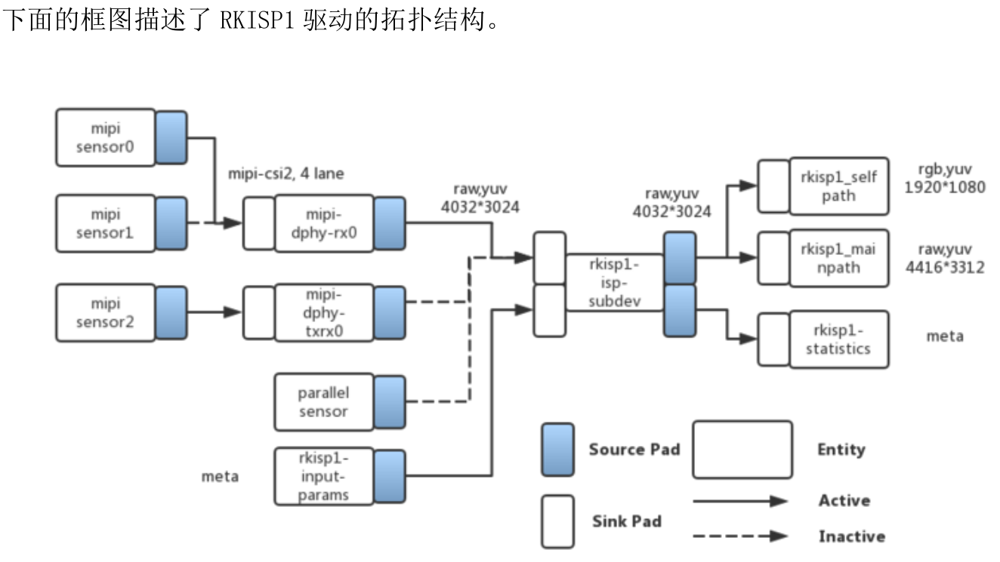
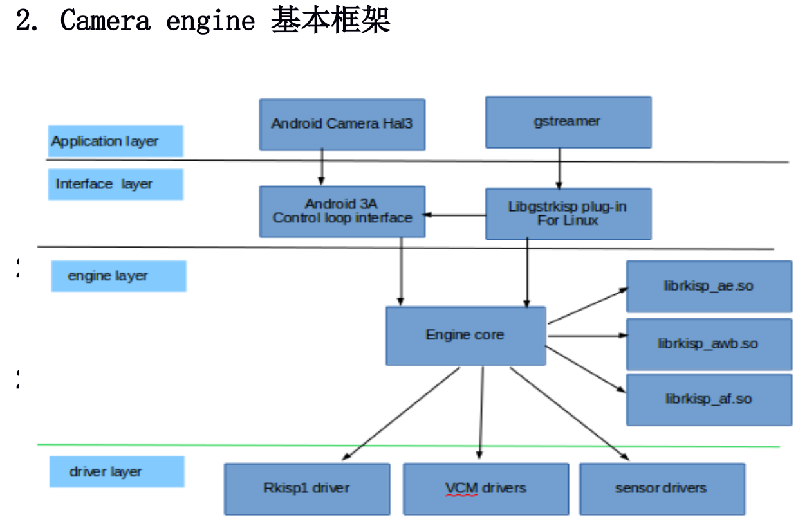

# Camera in linux

[参考文档 RKISP_Driver_User_Manual](RKISP_Driver_User_Manual)

[参考文档 Camera_Engine_Rkisp_User_Manual](Camera_Engine_Rkisp_User_Manual)

## 名词说明

rkisp1表示新版本isp驱动,在devicetree中有如下两个节点

	rkisp1@ff910000
	rkisp1@ff920000

cif_isp表示就版本isp驱动,在devicetree中有如下两个节点

	cif_isp@ff910000
	cif_isp@ff920000

## CIS(cmos image sensor)摄像头驱动

查看驱动版本信息(dmesg | grep rkisp)

	rkisp1 ff910000.rkisp1: rkisp1 driver version: v00.01.02

或查看节点信息

	cat /sys/module/video_rkisp1/parameters/version

### MIPI CIS注册

下面以isp0和ov13850为例进行说明(只做链路联通实例,其余信息省略)

连接情况sensor<-->mipi_dphy<-->isp

	//sensor
	ov13850:ov13850@10 {
		port {
			ucam_out0: endpoint {
			remote-endpoint = <&mipi_in_ucam0>; //mipi dphy端的port名
			data-lanes = <1>; // 1lane
			//data-lanes = <1 2>; // 2lane
			//data-lanes = <1 2 3 4>; // 4lane
		};
	};

	//mipi dphy
	&mipi_dphy_rx0 {
		port {
			port@0 {
				mipi_in_ucam0: endpoint@1 {
					remote-endpoint = <&ucam_out0>; //sensor端的port名
				};
			};
			port@1 {
				dphy_rx0_out: endpoint@0 {
					remote-endpoint = <&isp0_mipi_in>; //isp端的port名
				};
			};
		};
	};

	//isp
	&rkisp1_0 {
		port {
			isp0_mipi_in: endpoint@0 {
				remote-endpoint = <dphy_rx0_out>; //mipi dphy端的port名
			};
		};
	};

	&isp0_mmu {
		status = "okay"; // isp驱动使用了iommu,所以isp iommu也需要打开
	};

### DVP CIS注册

两个DVP连接到一个ISP上(前,后摄像头)

	// dvp sensor1
	gc0312@21 {
		port {
			gc0312_out: endpoint {
				remote-endpoint = <&dvp_in_fcam>;// isp端的port名
			};
		};
	};

	// dvp sensor2
	gc2145@3c {
		port {
			gc2145_out: endpoint {
				remote-endpoint = <&dvp_in_bcam>;// isp 端的 port 名
			};
		};
	};

	// isp
	&rkisp1 {
		ports {
			port@0 {
				dvp_in_fcam: endpoint@0 {
					remote-endpoint = <&gc0312_out>;  // sensor端port名
				};
				dvp_in_bcam: endpoint@1 {
					remote-endpoint = <&gc2145_out>;  // sensor端port名
				};
			};
		};
	};

使用media-ctl查看拓扑结构

	[root@rk3399:/]# media-ctl -p
	Media controller API version 0.1.0

	Media device information
	------------------------
	driver          rkisp1
	model           rkisp1
	serial
	bus info
	hw revision     0x0
	driver version  0.0.0

	Device topology
	- entity 1: rkisp1-isp-subdev (4 pads, 5 links)
				type V4L2 subdev subtype Unknown flags 0
				device node name /dev/v4l-subdev0
			pad0: Sink
					[fmt:SBGGR10_1X10/2112x1568 field:none
					 crop.bounds:(0,0)/2112x1568
					 crop:(0,0)/2112x1568]
					<- "rockchip-mipi-dphy-rx":1 [ENABLED]
			pad1: Sink
					<- "rkisp1-input-params":0 [ENABLED]
			pad2: Source
					[fmt:YUYV8_2X8/2112x1568 field:none
					 crop.bounds:(0,0)/2112x1568
					 crop:(0,0)/2112x1568]
					-> "rkisp1_selfpath":0 [ENABLED]
					-> "rkisp1_mainpath":0 [ENABLED]
			pad3: Source
					-> "rkisp1-statistics":0 [ENABLED]

	- entity 2: rkisp1_mainpath (1 pad, 1 link)
				type Node subtype V4L flags 0
				device node name /dev/video0
			pad0: Sink
					<- "rkisp1-isp-subdev":2 [ENABLED]

	- entity 3: rkisp1_selfpath (1 pad, 1 link)
				type Node subtype V4L flags 0
				device node name /dev/video1
			pad0: Sink
					<- "rkisp1-isp-subdev":2 [ENABLED]

	- entity 4: rkisp1-statistics (1 pad, 1 link)
				type Node subtype V4L flags 0
				device node name /dev/video2
			pad0: Sink
					<- "rkisp1-isp-subdev":3 [ENABLED]

	- entity 5: rkisp1-input-params (1 pad, 1 link)
				type Node subtype V4L flags 0
				device node name /dev/video3
			pad0: Source
					-> "rkisp1-isp-subdev":1 [ENABLED]

	- entity 6: rockchip-mipi-dphy-rx (2 pads, 2 links)
				type V4L2 subdev subtype Unknown flags 0
				device node name /dev/v4l-subdev1
			pad0: Sink
					[fmt:SBGGR10_1X10/2112x1568 field:none]
					<- "ov13850 1-0036":0 [ENABLED]
			pad1: Source
					[fmt:SBGGR10_1X10/2112x1568 field:none]
					-> "rkisp1-isp-subdev":0 [ENABLED]

	- entity 7: ov13850 1-0036 (1 pad, 1 link)
				type V4L2 subdev subtype Sensor flags 0
				device node name /dev/v4l-subdev2
			pad0: Source
					[fmt:SBGGR10_1X10/2112x1568@10000/300000 field:none]
					-> "rockchip-mipi-dphy-rx":0 [ENABLED]

## 摄像头应用

Buildroot中手动编译camera_engine

	make -C /path/to/buildroot O=/path/to/buildroot/output/rockchip_rk3399 camera_engine_rkisp-rebuild

Buildroot编译中间产物目录/path/to/buildroot/output/rockchip_rk3399/build
Buildroot目标文件系统目录/path/to/buildroot/output/rockchip_rk3399/target

拷贝生成的文件到目标文件系统中

	camera_engine_rkisp-1.0/build/lib/librkisp.so ==> /path/to/target/usr/lib/
	camera_engine_rkisp-1.0/plugins/3a/rkiq/af/lib64/librkisp_af.so ==> usr/lib/rkisp/af/
	camera_engine_rkisp-1.0/plugins/3a/rkiq/aec/lib64/librkisp_aec.so ==> usr/lib/rkisp/ae/
	camera_engine_rkisp-1.0/plugins/3a/rkiq/awb/lib64/librkisp_awb.so ==> usr/lib/rkisp/awb/
	camera_engine_rkisp-1.0/build/lib/libgstrkisp.so ==> usr/lib/gstreamer-1.0/

buildroot SDK中(buildroot/package/rockchip/camera_engine_rkisp/camera_engine_rkisp.mk)已完成上述拷贝

	$(INSTALL) -D -m 644 $(@D)/build/lib/librkisp.so $(TARGET_DIR)/usr/lib/
	$(INSTALL) -D -m 644 $(@D)/plugins/3a/rkiq/af/$(CAMERA_ENGINE_RKISP_LIB)/librkisp_af.so $(RKafDir)/
	$(INSTALL) -D -m 644 $(@D)/plugins/3a/rkiq/aec/$(CAMERA_ENGINE_RKISP_LIB)/librkisp_aec.so $(RKaeDir)/
	$(INSTALL) -D -m 644 $(@D)/plugins/3a/rkiq/awb/$(CAMERA_ENGINE_RKISP_LIB)/librkisp_awb.so $(RKawbDir)/
	$(INSTALL) -D -m 644 $(@D)/build/lib/libgstrkisp.so $(RKgstDir)/

IQ文件会全部拷贝到etc/iqfiles目录下

	$(INSTALL) -D -m 644 $(@D)/iqfiles/*.xml $(TARGET_DIR)/etc/iqfiles/

当系统启动后,如下脚本来匹配当前连接的sensor来设置链接/etc/cam_iq.xml

	/etc/init.d/S50set_pipeline start

### Test mipi camera(on Buildroot system)

Test mipi camera using gstreamer(camera_rkisp.sh)

	export LD_LIBRARY_PATH=$LD_LIBRARY_PATH:/usr/lib/gstreamer-1.0
	gst-launch-1.0 rkisp device=/dev/video0 io-mode=1 analyzer=1 enable-3a=1 path-iqf=/etc/cam_iq.xml ! video/x-raw,format=NV12,width=640,height=480, framerate=30/1 ! videoconvert ! autovideosink

Dump picture to file(using 7yuv to view the file)

	export LD_LIBRARY_PATH=$LD_LIBRARY_PATH:/usr/lib/gstreamer-1.0
	gst-launch-1.0 rkisp device=/dev/video0 io-mode=1 analyzer=1 enable-3a=1 path-iqf=/etc/cam_iq.xml ! video/x-raw,format=NV12,width=640,height=480, framerate=30/1 ! videoconvert ! filesink location=/tmp/streamer.yuv

Dump picture to file(using 7yuv to view the file)

	rkisp_demo --device=/dev/video0 --output=/tmp/streamer.yuv

### 抓取isp输出的yuv数据

使用如下命令获取yuv数据(7yuv中用格式1280x720 YUV420 planar NV21查看)

	media-ctl -d /dev/media0 --set-v4l2 '"ov13850 1-0036":0[fmt:SBGGR10_1X10/2112x1568]'
	media-ctl -d /dev/media0 --set-v4l2 '"rkisp1-isp-subdev":0[fmt:SBGGR10_1X10/2112x1568]'
	media-ctl -d /dev/media0 --set-v4l2 '"rkisp1-isp-subdev":0[crop:(0,0)/2112x1568]'
	media-ctl -d /dev/media0 --set-v4l2 '"rkisp1-isp-subdev":2[fmt:YUYV8_2X8/2112x1568]'
	media-ctl -d /dev/media0 --set-v4l2 '"rkisp1-isp-subdev":2[crop:(0,0)/2112x1568]'
	v4l2-ctl -d /dev/video0 \
		--set-selection=target=crop,top=336,left=432,width=1920,height=1080 \
		--set-fmt-video=width=1280,height=720,pixelformat=NV21 \
		--stream-mmap=3 --stream-to=/tmp/mp.out --stream-count=20 --stream-poll

### 抓取Sensor输出的Raw Bayer原始数据

使用如下命令获取raw bayer数据

	media-ctl -d /dev/media0 --set-v4l2 '"ov13850 1-0036":0[fmt:SBGGR10_1X10/2112x1568]'
	media-ctl -d /dev/media0 --set-v4l2 '"rkisp1-isp-subdev":0[fmt:SBGGR10_1X10/2112x1568]'
	media-ctl -d /dev/media0 --set-v4l2 '"rkisp1-isp-subdev":0[crop:(0,0)/2112x1568]'
	media-ctl -d /dev/media0 --set-v4l2 '"rkisp1-isp-subdev":2[fmt:SBGGR10_1X10/2112x1568]'
	media-ctl -d /dev/media0 --set-v4l2 '"rkisp1-isp-subdev":2[crop:(0,0)/2112x1568]'
	v4l2-ctl -d /dev/video0 --set-ctrl 'exposure=1216,analogue_gain=10' \
		--set-selection=target=crop,top=0,left=0,width=2592,height=1944 \
		--set-fmt-video=width=2112,height=1568,pixelformat=SBGGR10 \
		--stream-mmap=3 --stream-to=/tmp/mp.raw.out --stream-count=1 --stream-poll

### USB摄像头使用(linux distro系统)

[参考代码](./test_camera-uvc.sh)

使用如下命令使用UVC摄像头(非root用户, /dev/video0)

	export DISPLAY=:0.0
	gst-launch-1.0 v4l2src device=/dev/video0 ! mppvideodec ! rkximagesink sync=false

指定输出格式和大小

	gst-launch-1.0 v4l2src device=/dev/video0 ! "image/jpeg,width=640,height=480,framerate=30/1" ! mppvideodec ! rkximagesink sync=false

如果是用root用户则按如下执行(这里假设切换到linaro用户)

	export DISPLAY=:0.0
	su linaro -c "gst-launch-1.0 v4l2src device=/dev/video0 ! mppvideodec ! rkximagesink sync=false"

指定输出格式和大小

	su linaro -c 'gst-launch-1.0 v4l2src device=/dev/video0 ! "image/jpeg,width=640,height=480,framerate=30/1" ! mppvideodec ! rkximagesink sync=false'
