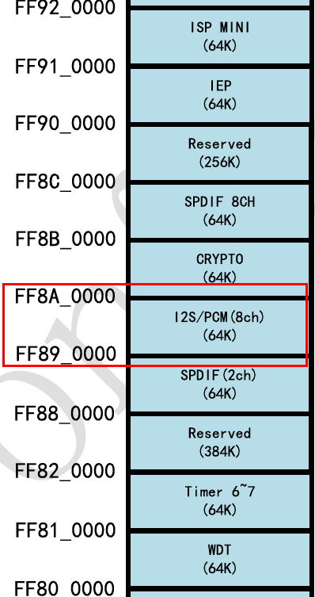
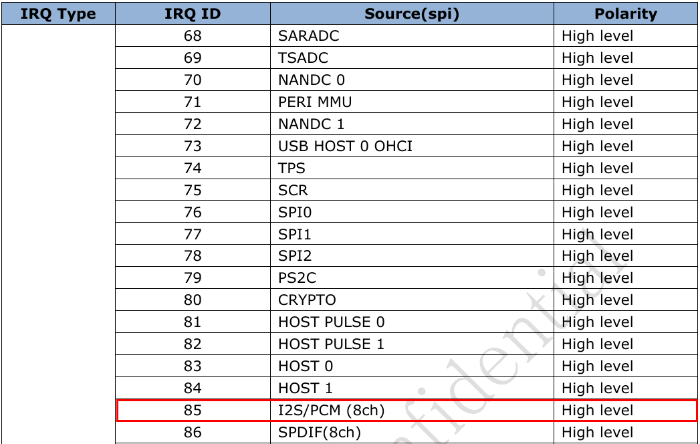

# Codec driver example(es8323/es8316 on rockchip)

## Codec驱动(es8323.c)

### 硬件连接

SPK_CTL连接GPIO7_B7

HP_CTL连接GPIO7_A4

HP_DET连接GPIO0_B5

### DeviceTree Describe

	&i2c2 {
	es8323: es8323@10 {
				compatible = "es8323";
				reg = <0x10>;
				spk-con-gpio = <&gpio7 GPIO_B7 GPIO_ACTIVE_HIGH>;
				hp-con-gpio = <&gpio0 GPIO_B5 GPIO_ACTIVE_HIGH>;
				hp-det-gpio = <&gpio7 GPIO_A4 GPIO_ACTIVE_HIGH>;
			};
	};

## Machine驱动(rk_es8323.c rockchip平台)

### DeviceTree Describe

	/ {
		rockchip-es8323 {
			compatible = "rockchip-es8323";
			dais {
				dai0 {
					audio-codec = <&es8323>;
					audio-controller = <&i2s>;
					format = "i2s";
				};
			};
		};
	};

## Platform驱动(rk_i2s.c rockchip平台)

### DeviceTree Describe

	i2s: rockchip-i2s@0xff890000 {
			 compatible = "rockchip-i2s";
			 reg = <0xff890000 0x10000>;
			 i2s-id = <0>;
			 clocks = <&clk_i2s>, <&clk_i2s_out>, <&clk_gates10 8>;
			 clock-names = "i2s_clk","i2s_mclk", "i2s_hclk";
			 interrupts = <GIC_SPI 85 IRQ_TYPE_LEVEL_HIGH>;
			 dmas = <&pdma0 0>, <&pdma0 1>;
			 dma-names = "tx", "rx";
			 pinctrl-names = "default", "sleep";
			 pinctrl-0 = <&i2s_mclk &i2s_sclk &i2s_lrckrx &i2s_lrcktx &i2s_sdi &i2s_sdo0 &i2s_sdo1 &i2s_sdo2 &i2s_sdo3>;
			 pinctrl-1 = <&i2s_gpio>;
		 };

### 从datasheet里Address Mapping可以找到I2S控制器被映射到的位置

### 中断号(SPI[85])

### DMA编号(tx[0], rx[1])

### I2S寄存器信息,32bit,步进4

## Usage

将es8323.dtsi包含到主dts中

	#include "es8323.dtsi"

加载codec驱动

	insmod es8323.ko

	cat /sys/kernel/debug/asoc/codecs

	内容如下(i2c_driver name.i2c控制器号-I2C设备地址)
	ES8323 codec.2-0010

	cat /sys/kernel/debug/asoc/dais
	ES8323 HiFi

加载platform驱动

	insmod rk_i2s.ko
	cat /sys/kernel/debug/asoc/dais
	内容如下(i2s控制器号地址.dainame)
	ff890000.rockchip-i2s

	cat /sys/kernel/debug/asoc/platforms
	内容如下(i2s控制器号地址.dainame)
	ff890000.rockchip-i2s

加载machine驱动

	insmod rk_es8323.ko 有如下信息表示成功,连接两个个dai
	ES8323 HiFi <-> ff890000.rockchip-i2s mapping ok

所有probe成功后在下面目录会有相关信息

	/dev/snd/
	/proc/asound/cards
	/sys/kernel/debug/asoc/
	/sys/class/sound/

## Test

录音

	tinycap test.wav

播放

	tinyplay test.wav

参数控制(查看所有可调参数)

	tinymix

查看某个参数值

	tinymix <ctrl id>

修改某个参数值

	tinymix <ctrl id> <value>

## Codec驱动(es8316.c)

### 硬件连接(同ES8323)

### DeviceTree Describe

	&i2c2 {
	es8316: es8316@10 {
				compatible = "es8316";
				reg = <0x10>;
				spk-con-gpio = <&gpio7 GPIO_B7 GPIO_ACTIVE_HIGH>;
				hp-con-gpio = <&gpio0 GPIO_B5 GPIO_ACTIVE_HIGH>;
				hp-det-gpio = <&gpio7 GPIO_A4 GPIO_ACTIVE_HIGH>;
			};
	};

## Machine驱动(rk_es8316.c rockchip平台)

### DeviceTree Describe

	/ {
		rockchip-es8316 {
			compatible = "rockchip-es8316";
			dais {
				dai0 {
					audio-codec = <&es8316>;
					audio-controller = <&i2s>;
					format = "i2s";
				};
			};
		};
	};

## Platform驱动(rk_i2s.c rockchip平台, 同ES8323)

## 耳机检测

[参考文章Android4.×耳机插拔检测](http://blog.csdn.net/fengying765/article/details/38301483)

[参考文章Android 耳机插拔处理流程](http://blog.csdn.net/xxm282828/article/details/45542039)

### 名词解释

headphone 耳机

micphone 麦克风

headset (耳麦)带有麦克风的耳机 headphone + micphone

### 设置android使用InputEvent检测

修改frameworks/base/core/res/res/values/config.xml

	修改为true
	<bool name="config_useDevInputEventForAudioJack">true</bool>

### 驱动中添加相关代码如下

	snd_soc_jack_new(codec, "Headset Jack", SND_JACK_HEADSET, &chip->jack);

	snd_soc_jack_report(&chip->jack, SND_JACK_HEADPHONE, SND_JACK_HEADSET);

### 调试

	adb shell getevent 能够获得插拔耳机的事件

## Attached

### spin lock

[参考文章](http://blog.csdn.net/droidphone/article/details/7395983)

- 如果只是在普通线程之间同时访问共享对象

	使用spin_lock()/spin_unlock()

- 如果是在中断和普通线程之间同时访问共享对象,并且确信退出临界区后要打开中断

	使用spin_lock_irq()/spin_unlock_irq()

- 如果是在中断和普通线程之间同时访问共享对象,并且退出临界区后要保持中断的状态

	使用spin_lock_irqsave()/spin_unlock_irqrestore()

### PCM是什么

[参考文章](http://blog.csdn.net/droidphone/article/details/6308006)

PCM是英文Pulse-code modulation的缩写,中文译名是脉冲编码调制

PCM就是要把声音从模拟转换成数字信号的一种技术

playback:如何把用户空间的应用程序发过来的PCM数据,转化为人耳可以辨别的模拟音频

capture:把mic拾取到得模拟信号,经过采样,量化,转换为PCM信号送回给用户空间的应用程序
