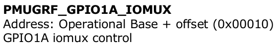
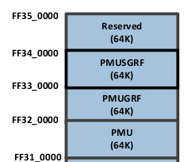
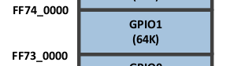

# GPIO状态调试

## 假设现在想要查看GPIO1_A0的mux状态

GPIO1对应的寄存器名为PMUGRF_GPIO1A_IOMUX(offset 0x10)

查看手册知道PMUGRF的基地址如下截图(FF32_0000 - FF33_0000)

查看该寄存器的值

	io -4 -r 0xff320010

## 查看该IO口是高电平还是低电平

GPIO1对应的寄存器基地址为(FF73_0000 - FF74_0000)

## 控制IO口输出状态

IO口的值保存在GPIO_SWPORTA_DR(offset 0x0)寄存器中

查看该寄存器的值(其中最低位对应GPIO1_A0)

	io -4 -r 0xff730000

将GPIO1_A0拉高

	io -4 -w 0xff730000 0x01822401

将GPIO1_A0拉低

	io -4 -w 0xff730000 0x01822400
