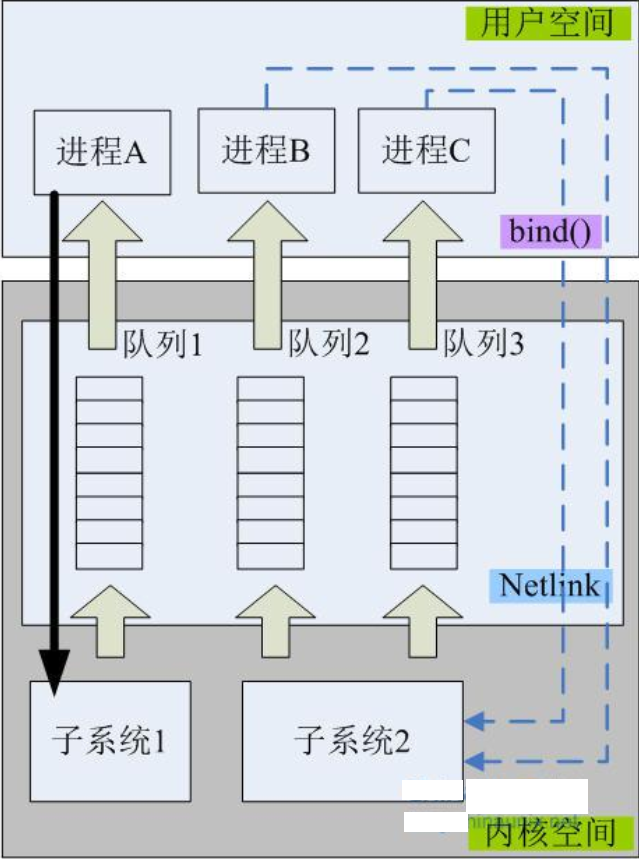
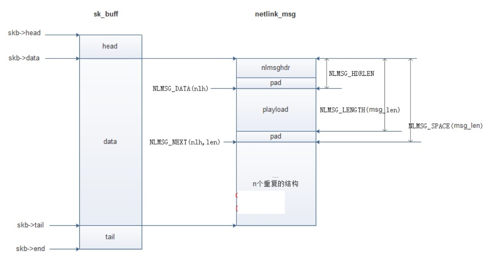
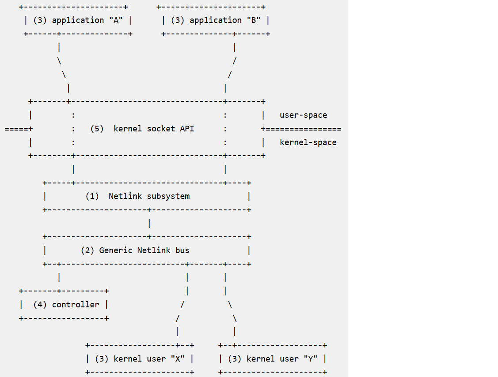
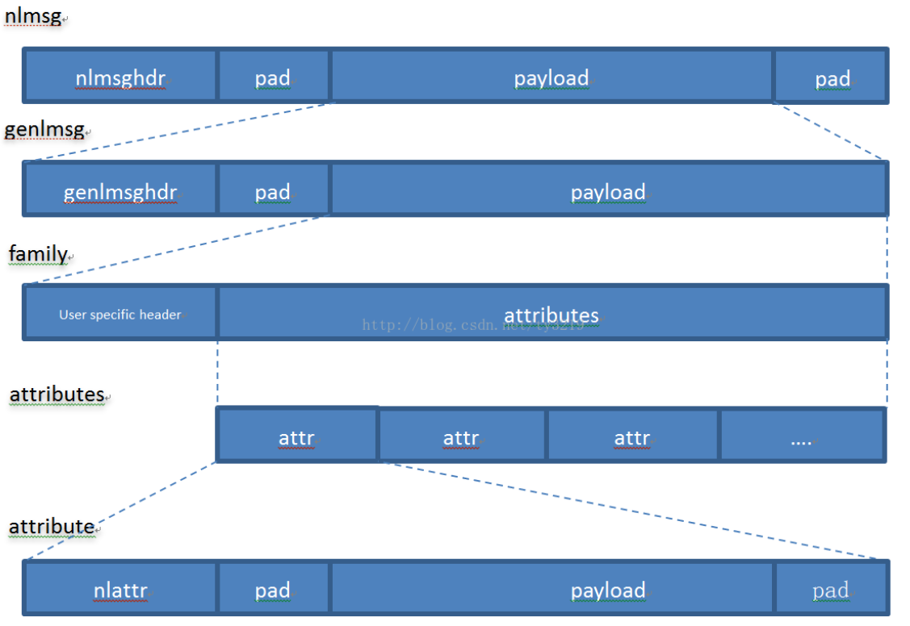

# Linux (Generic) NetLink

### 什么是Netlink

[参考文章 用户空间和内核空间通讯](http://blog.chinaunix.net/uid-23069658-id-3400761.html)

关于Netlink的理解,需要把握几个关键点

- 面向数据报的无连接消息子系统
- 基于通用的BSD Socket架构而实现

Netlink可以实现如下通信

内核->用户和用户->内核的双向,异步的数据通信,同时它还支持两个用户进程之间,甚至两个内核子系统之间的数据通信

### Netlink通信类型

Netlink支持两种类型的通信方式:单播和多播

- 单播:经常用于一个用户进程和一个内核子系统之间1:1的数据通信.用户空间发送命令到内核,然后从内核接受命令的返回结果.
- 多播:经常用于一个内核进程和多个用户进程之间的1:N的数据通信.内核作为会话的发起者,用户空间的应用程序是接收者.为了实现这个功能,内核空间的程序会创建一个多播组,然后所有用户空间的对该内核进程发送的消息感兴趣的进程都加入到该组即可接收来自内核发送的消息了

其中进程A和子系统1之间是单播通信,进程B,C和子系统2是多播通信.上图还向我们说明了一个信息.从用户空间传递到内核的数据是不需要排队的,即其操作是同步完成;而从内核空间向用户空间传递数据时需要排队,是异步的.假如向内核发送了一个消息需要获取内核中某些信息,比如路由表,或其他信息,如果路由表过于庞大,那么内核在通过Netlink向应用返回数据时,应用可以好生琢磨一下如何接收这些数据的问题,毕竟已经看到了那个输出队列了,不能视而不见

### Netlink编程需要注意的问题

基于Netlink的用户/内核通信,有两种情况可能会导致丢包

- 内存耗尽
- 用户空间接收进程的缓冲区溢出.导致缓冲区溢出的主要原因有可能是:用户空间的进程运行太慢;或者接收队列太短

如果Netlink不能将消息正确传递到用户空间的接收进程,那么用户空间的接收进程在调用recvmsg()系统调用时就会返回一个内存不足(ENOBUFS)的错误,这一点需要注意.换句话说,缓冲区溢出的情况是不会发送在从用户->内核的sendmsg()系统调用里(同步操作)

当然,如果使用的是阻塞型socket通信,也就不存在内存耗尽的隐患了

一般netlink demo([demo1_user.c](demo1_user.c) [demo2_kernel.c](demo2_kernel.c))

## Generic Netlink

[generic_netlink_howto](https://wiki.linuxfoundation.org/networking/generic_netlink_howto#architectural-overview)

[Generic Netlink(genl)介绍与例子](https://blog.csdn.net/ty3219/article/details/63683698)

介绍Generic Netlink之前,不得不说Netlink.Netlink是一种灵活的并且健壮的通讯方式,
可以用于kernel to user,user to kernel,kernel to kernel甚至user to user的通讯
Netlink的通道是通过Family来组织的,但随着使用越来越多,
Family ID已经不够分配了,所以才有了Generic Netlink.
所以,Generic Netlink其实是对Netlink报文中的数据进行了再次封装

Generic Netlink 架构如下

Genl数据包结构如下图

- genl机制的数据包分了4层
- 用户的实际数据封装在attribute里
- 一个或多个attribute可以被封装在用户自定义的一个family报文里
- 一个family报文又被封装在genlmsg里,最后genlmsg被封装在nlmsg里,总共4层

### User2Kernel

user2kernel 工作流程([demo2_user.c](demo2_user.c) [demo2_kernel.c](demo2_kernel.c))

	对于从user to kernel的通讯,driver必须先向内核注册一个struct genl_family,
	并且注册一些cmd的处理函数.这些cmd是跟某个family关联起来的.
	注册family的时候我们可以让内核自动为这个family分配一个ID.
	每个family都有一个唯一的ID,其中ID号0x10是被内核的nlctrl family所使用.
	当注册成功以后,如果user program向某个family发送cmd,那么内核就会回调对应cmd的处理函数.
	对于user program,使用前,除了要创建一个socket并绑定地址以外,还需要先通过family的名字获取family的ID.
	获取方法,就是向nlctrl这个family查询.详细的方法可以看后面的例子.有了family的ID以后,才能向该family发送cmd

### Kernel2User

kernel2user 工作流程([demo3_user.c](demo3_user.c) [demo3_kernel.c](demo3_kernel.c))

	对于从kernel to user的通讯,采用的是广播的形式,
	只要user program监听了,都能收到.但是同样的,
	user program在监听前,也必须先查询到family的ID

测试方法

加载内核模块

	insmod demo3_kernel.ko

启动两个应用程序

	./demo3_user
	./demo3_user

触发内核上报消息通知所有应用程序

	echo 1 > /sys/kernel/genl_test/genl_trigger
