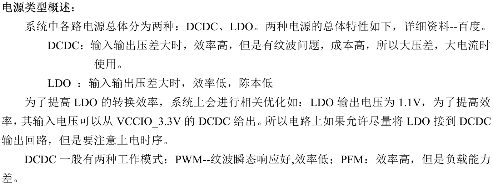
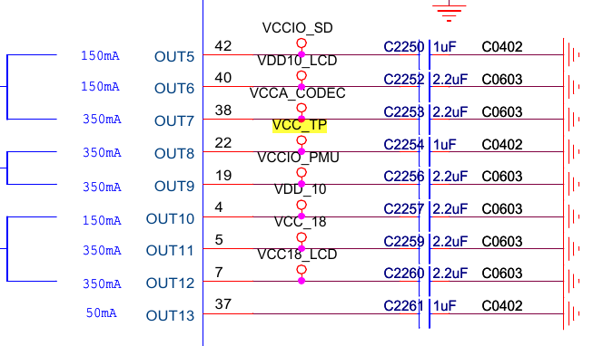

# Regulator Usage

## DCDC & LDO



## ACT8846 PMU驱动

框架图如下


由图可知

REG[1, 4]对应DCDC[1, 4]

REG[5, 13]对应LDO[1, 9]

驱动代码中的voltage map可以参考手册的table 5

	 600, 625, 650, 675, 700, 725, 750, 775,
	 800, 825, 850, 875, 900, 925, 950, 975,
	 1000, 1025, 1050, 1075, 1100, 1125, 1150,
	 1175, 1200, 1250, 1300, 1350, 1400, 1450,
	 1500, 1550, 1600, 1650, 1700, 1750, 1800,
	 1850, 1900, 1950, 2000, 2050, 2100, 2150,
	 2200, 2250, 2300, 2350, 2400, 2500, 2600,
	 2700, 2800, 2900, 3000, 3100, 3200,
	 3300, 3400, 3500, 3600, 3700, 3800, 3900,


### 设备树配置

在所使用的主dts文件里包含act8846.dtsi的设备树文件即可

	#include "act8846.dtsi"

假设act8846接到主控I2C的I2C0上则且I2C0标号为i2c0则可以直接使用,否则只需改下I2C的编号即可

### 触摸屏硬件连接和设备树配置

以下图所示的一个TP模块连接方式来说明




VCC_TP给TP供电,由PMU上的LDO提供

TP的device tree如下描述这里并不完整,少里对PIN脚等的描述

```shell
goodix_ts@5d {
    compatible = "goodix,gt9xx";
    status = "okay";
    reg = <0x5d>;
    VCC_TP-supply = <&ldo4_reg>;
}
```

其中VCC_TP-supply这样写比较规范

VCC_TP和原理图上标的对应(纯粹为了好记,让代码和图对应)

supply是固定后缀,可以从代码里得知

为什么对应ldo4_reg?

regulator的寄存器从0开始计算

OUT8 对应就对应regulator 7

而regulator 7 的标号就是ldo4_reg,这里是device tree的语法

```shell
ldo4_reg:regulator@7 {
	reg = <0x7>;
	regulator-compatible = "act_ldo4";
	regulator-name = "act_ldo4";
	regulator-min-microvolt = <0x325aa0>;
	regulator-max-microvolt = <0x325aa0>;
	linux,phandle = <0xc2>;
	phandle = <0xc2>;
};
```

### 测试方法

- 加载PMU驱动

	insmod act8846.ko

- 不断开关regulator7的电压

```shell
while true
do
insmod regulator.ko
sleep 5
rmmod regulator
sleep 5
done
```

- 查看regulator7开关状态

```shell
while true
do
cat /sys/class/regulator/regulator.8/state
sleep 2
done
```

## RK818 PMU驱动

### 测试方法

- 加载PMU驱动

	insmod rk818.ko

- 不断开关LDO2的电压

```shell
while true
do
insmod rk818_test.ko
sleep 5
rmmod rk818_test
sleep 5
done
```

- 查看regulator开关状态

```shell
while true
do
cat /sys/class/regulator/regulator.7/state
sleep 2
done
```
