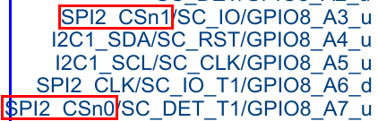

# SPI

## 设备树描述

每一个spi对应一个SPI控制器(可以叫做一个bus)

	spi0 ==> bus 0
	spi1 ==> bus 1
	spi2 ==> bus 2

其中每个SPI控制器上片选数在原理图上描述如下
在控制器描述上也可以找得到相应信息

	SPI0_CSn0
	SPI0_CSn1

	SPI1_CSn0

	SPI2_CSn0
	SPI2_CSn1

## 应用实例

SPI2控制器上接有两个SPI设备分别使用cs0(demoAAA),cs1(demoBBB)

	&spi2 {
		demoAAA@20 {
			compatible = "spi_test_bus2_cs0";
			reg = <0>;
		};

		demoBBB@21 {
			compatible = "spi_test_bus2_cs1";
			reg = <1>;
		};
	};

其中注意以下两个地方

@后面的地址

	demoAAA@20
	2 : 表示spi2
	0 : 表示使用的是片选0

	demoBBB@21
	2 : 表示spi2
	1 : 表示使用的是片选1

reg表示使用的片选

	reg = <0> 表示使用的是片选0
	reg = <1> 表示使用的是片选1

## 数据结构

spi_transfer

	struct spi_transfer - a read/write buffer pair
	@tx_buf: data to be written (dma-safe memory), or NULL
	@rx_buf: data to be read (dma-safe memory), or NULL
	@len: size of rx and tx buffers (in bytes)
	@cs_change: affects chipselect after this transfer completes

## Debug

read and write test

	cat /dev/ttysWK0
	echo 1 > /dev/ttysWK0

测试脚本

	i=1
	while true
	do
	if [ $i -eq 10 ]
	then
	(( i=1 ))
	fi
	echo $i > /dev/ttysWK0
	sleep 1
	(( i+=1 ))
	done
