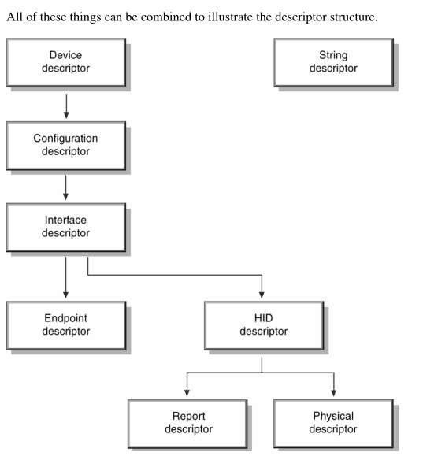
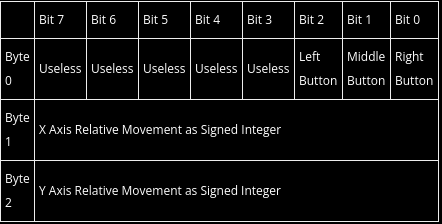
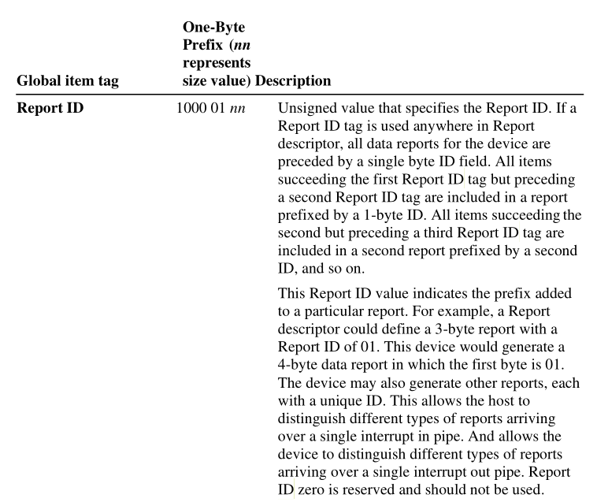

# USB HID Class

[参考文章 usb hid report descriptors](https://eleccelerator.com/tutorial-about-usb-hid-report-descriptors/)

[Device Class Definition for Human Interface Devices(HID)](hid1_11.pdf)

hid report descriptors在usb描述符中的关系

下面是一个三个按键的标准鼠标

在代码中用数据结构表示如下

	struct mouse_report_t
	{
		uint8_t buttons;
		int8_t x;
		int8_t y;
	}

在hid report descriptors中3个按键描述如下

	USAGE_PAGE (Button)
	USAGE_MINIMUM (Button 1)
	USAGE_MAXIMUM (Button 3)

每个按键用两个值来表示(0和1)

	LOGICAL MINIMUM (0)
	LOGICAL MAXIMUM (1)

总共有3个按键

	REPORT_COUNT (3) # 每个按键时单独上报,需要上报3次按键信息
	REPORT_SIZE (1) # 每次上报的大小为1bit

上报数据描述

	INPUT (Data, Var, Abs)

所以按键的所有描述合起来就是如下

	USAGE_PAGE (Button)
	USAGE_MINIMUM (Button 1)
	USAGE_MAXIMUM (Button 3)
	LOGICAL_MINIMUM (0)
	LOGICAL_MAXIMUM (1)
	REPORT_COUNT (3)
	REPORT_SIZE (1)
	INPUT (Data,Var,Abs)

由于上报数据需要按照8bit对齐,所以剩余的未使用的5bit数据也需要描述

	REPORT_COUNT (1) # 只需要上报一次
	REPORT_SIZE (5) # 一次性上报5bit数据
	INPUT (Cnst,Var,Abs)

x轴的数据上报(y轴同理)

	USAGE_PAGE (Generic Desktop)
	USAGE (X)
	LOGICAL_MINIMUM (-127)
	LOGICAL_MAXIMUM (127)
	REPORT_SIZE (8) # 一次上报8bit数据
	REPORT_COUNT (1) # 上报一次
	INPUT (Data,Var,Rel)

可以将xy轴的数据合并起来表示

	USAGE_PAGE (Generic Desktop)
	USAGE (X)
	USAGE (Y)
	LOGICAL_MINIMUM (-127)
	LOGICAL_MAXIMUM (127)
	REPORT_SIZE (8) # 每次上报8bit数据
	REPORT_COUNT (2) # 需要上报2次
	INPUT (Data,Var,Rel)

按键合xy轴合起来如下

	USAGE_PAGE (Button)
	USAGE_MINIMUM (Button 1)
	USAGE_MAXIMUM (Button 3)
	LOGICAL_MINIMUM (0)
	LOGICAL_MAXIMUM (1)
	REPORT_COUNT (3)
	REPORT_SIZE (1)
	INPUT (Data,Var,Abs)
	REPORT_COUNT (1)
	REPORT_SIZE (5)
	INPUT (Cnst,Var,Abs)
	USAGE_PAGE (Generic Desktop)
	USAGE (X)
	USAGE (Y)
	LOGICAL_MINIMUM (-127)
	LOGICAL_MAXIMUM (127)
	REPORT_SIZE (8)
	REPORT_COUNT (2)
	INPUT (Data,Var,Rel)

还需要添加一些描述信息来表明是鼠标

	USAGE_PAGE (Generic Desktop)
	USAGE (Mouse)
	COLLECTION (Application)
		USAGE (Pointer)
		COLLECTION (Physical)

		... # 将之前的信息填在这里

		END COLLECTION
	END COLLECTION

所以代码中就出现了如下代码(如下代码来源qemu中的dev-hid.c)

	static const uint8_t qemu_mouse_hid_report_descriptor[] = {
		0x05, 0x01,		/* Usage Page (Generic Desktop) */
		0x09, 0x02,		/* Usage (Mouse) */
		0xa1, 0x01,		/* Collection (Application) */
		0x09, 0x01,		/*   Usage (Pointer) */
		0xa1, 0x00,		/*   Collection (Physical) */
		0x05, 0x09,		/*     Usage Page (Button) */
		0x19, 0x01,		/*     Usage Minimum (1) */
		0x29, 0x03,		/*     Usage Maximum (3) */
		0x15, 0x00,		/*     Logical Minimum (0) */
		0x25, 0x01,		/*     Logical Maximum (1) */
		0x95, 0x03,		/*     Report Count (3) */
		0x75, 0x01,		/*     Report Size (1) */
		0x81, 0x02,		/*     Input (Data, Variable, Absolute) */
		0x95, 0x01,		/*     Report Count (1) */
		0x75, 0x05,		/*     Report Size (5) */
		0x81, 0x01,		/*     Input (Constant) */
		0x05, 0x01,		/*     Usage Page (Generic Desktop) */
		0x09, 0x30,		/*     Usage (X) */
		0x09, 0x31,		/*     Usage (Y) */
		0x09, 0x38,		/*     Usage (Wheel) */
		0x15, 0x81,		/*     Logical Minimum (-0x7f) */
		0x25, 0x7f,		/*     Logical Maximum (0x7f) */
		0x75, 0x08,		/*     Report Size (8) */
		0x95, 0x03,		/*     Report Count (3) */
		0x81, 0x06,		/*     Input (Data, Variable, Relative) */
		0xc0,		/*   End Collection */
		0xc0,		/* End Collection */
	}

qemu代码里描述上述鼠标按键的结构时HIDPointerEvent

	typedef struct HIDPointerEvent {
		int32_t xdx, ydy; /* relative iff it's a mouse, otherwise absolute */
		int32_t dz, buttons_state;
	} HIDPointerEvent;

能否让一个鼠标同时支持绝对和相对坐标(通过配置两个report id)

需要在上报的第一个byte里填充report id就能达到效果

	typedef struct HIDPointerEvent {
		int8_t report_id;
		int32_t xdx, ydy; /* relative iff it's a mouse, otherwise absolute */
		int32_t dz, buttons_state;
	} HIDPointerEvent;

在report descriptors中添加report id的描述

	static const uint8_t qemu_mouse_hid_report_descriptor[] = {
		0x05, 0x01,		/* Usage Page (Generic Desktop) */
		0x09, 0x02,		/* Usage (Mouse) */
		0xa1, 0x01,		/* Collection (Application) */
		0x85, 0x01, 	/* report id 1 */
		0x09, 0x01,		/*   Usage (Pointer) */
		0xa1, 0x00,		/*   Collection (Physical) */
		0x05, 0x09,		/*     Usage Page (Button) */
		0x19, 0x01,		/*     Usage Minimum (1) */
		0x29, 0x03,		/*     Usage Maximum (3) */
		0x15, 0x00,		/*     Logical Minimum (0) */
		0x25, 0x01,		/*     Logical Maximum (1) */
		0x95, 0x03,		/*     Report Count (3) */
		0x75, 0x01,		/*     Report Size (1) */
		0x81, 0x02,		/*     Input (Data, Variable, Absolute) */
		0x95, 0x01,		/*     Report Count (1) */
		0x75, 0x05,		/*     Report Size (5) */
		0x81, 0x01,		/*     Input (Constant) */
		0x05, 0x01,		/*     Usage Page (Generic Desktop) */
		0x09, 0x30,		/*     Usage (X) */
		0x09, 0x31,		/*     Usage (Y) */
		0x09, 0x38,		/*     Usage (Wheel) */
		0x15, 0x81,		/*     Logical Minimum (-0x7f) */
		0x25, 0x7f,		/*     Logical Maximum (0x7f) */
		0x75, 0x08,		/*     Report Size (8) */
		0x95, 0x03,		/*     Report Count (3) */
		0x81, 0x06,		/*     Input (Data, Variable, Relative) */
		0xc0,		/*   End Collection */
		0xc0,		/* End Collection */
	}

其中格式解读如下(report id可以用一个或多个byte来表示)

	report_tag(1000 01nn) + nbyte_report_id

如果用一个byte表示,则nn = 01, report id tag就是 1000 0101 ==> 0x85

则表示report id 1结果如下

	0x85, 0x01, 	/* report id 1 */

上面的修改只是修改来report descriptors上报数据的格式需要上报report id
,在实际上报的usb数据里也需要修改能上报report id,修改如下

鼠标坐标的处理函数是(hid_pointer_event)

在相对坐标和绝对坐标中分别上报不同的report id(需要和report descriptors一致,将tablet的直接全部拷贝即可)

	hid_pointer_event
		case INPUT_EVENT_KIND_REL:
			e->report_id = 1;
		case INPUT_EVENT_KIND_ABS:
			e->report_id = 2;

在usb写数据到端点时,在最前面的第一个byte填充report id

	hid_pointer_poll
		case HID_MOUSE:
			if (len > l) {
				buf[l++] = e->report_id;
			}

相对鼠标和绝对鼠标report descriptors

	static const uint8_t qemu_mouse_hid_report_descriptor[] = {
		0x05, 0x01,		/* Usage Page (Generic Desktop) */
		0x09, 0x02,		/* Usage (Mouse) */
		0xa1, 0x01,		/* Collection (Application) */
		0x85, 0x01, /* report id 1 */
		0x09, 0x01,		/*   Usage (Pointer) */
		0xa1, 0x00,		/*   Collection (Physical) */
		0x05, 0x09,		/*     Usage Page (Button) */
		0x19, 0x01,		/*     Usage Minimum (1) */
		0x29, 0x03,		/*     Usage Maximum (3) */
		0x15, 0x00,		/*     Logical Minimum (0) */
		0x25, 0x01,		/*     Logical Maximum (1) */
		0x95, 0x03,		/*     Report Count (3) */
		0x75, 0x01,		/*     Report Size (1) */
		0x81, 0x02,		/*     Input (Data, Variable, Absolute) */
		0x95, 0x01,		/*     Report Count (1) */
		0x75, 0x05,		/*     Report Size (5) */
		0x81, 0x01,		/*     Input (Constant) */
		0x05, 0x01,		/*     Usage Page (Generic Desktop) */
		0x09, 0x30,		/*     Usage (X) */
		0x09, 0x31,		/*     Usage (Y) */
		0x09, 0x38,		/*     Usage (Wheel) */
		0x15, 0x81,		/*     Logical Minimum (-0x7f) */
		0x25, 0x7f,		/*     Logical Maximum (0x7f) */
		0x75, 0x08,		/*     Report Size (8) */
		0x95, 0x03,		/*     Report Count (3) */
		0x81, 0x06,		/*     Input (Data, Variable, Relative) */
		0xc0,		/*   End Collection */
		0xc0,		/* End Collection */

		0x05, 0x01,		/* Usage Page (Generic Desktop) */
		0x09, 0x02,		/* Usage (Mouse) */
		0xa1, 0x01,		/* Collection (Application) */
		0x85, 0x02, /* report id 2 */
		0x09, 0x01,		/*   Usage (Pointer) */
		0xa1, 0x00,		/*   Collection (Physical) */
		0x05, 0x09,		/*     Usage Page (Button) */
		0x19, 0x01,		/*     Usage Minimum (1) */
		0x29, 0x03,		/*     Usage Maximum (3) */
		0x15, 0x00,		/*     Logical Minimum (0) */
		0x25, 0x01,		/*     Logical Maximum (1) */
		0x95, 0x03,		/*     Report Count (3) */
		0x75, 0x01,		/*     Report Size (1) */
		0x81, 0x02,		/*     Input (Data, Variable, Absolute) */
		0x95, 0x01,		/*     Report Count (1) */
		0x75, 0x05,		/*     Report Size (5) */
		0x81, 0x01,		/*     Input (Constant) */
		0x05, 0x01,		/*     Usage Page (Generic Desktop) */
		0x09, 0x30,		/*     Usage (X) */
		0x09, 0x31,		/*     Usage (Y) */
		0x15, 0x00,		/*     Logical Minimum (0) */
		0x26, 0xff, 0x7f,	/*     Logical Maximum (0x7fff) */
		0x35, 0x00,		/*     Physical Minimum (0) */
		0x46, 0xff, 0x7f,	/*     Physical Maximum (0x7fff) */
		0x75, 0x10,		/*     Report Size (16) */
		0x95, 0x02,		/*     Report Count (2) */
		0x81, 0x02,		/*     Input (Data, Variable, Absolute) */
		0x05, 0x01,		/*     Usage Page (Generic Desktop) */
		0x09, 0x38,		/*     Usage (Wheel) */
		0x15, 0x81,		/*     Logical Minimum (-0x7f) */
		0x25, 0x7f,		/*     Logical Maximum (0x7f) */
		0x35, 0x00,		/*     Physical Minimum (same as logical) */
		0x45, 0x00,		/*     Physical Maximum (same as logical) */
		0x75, 0x08,		/*     Report Size (8) */
		0x95, 0x01,		/*     Report Count (1) */
		0x81, 0x06,		/*     Input (Data, Variable, Relative) */
		0xc0,		/*   End Collection */
		0xc0,		/* End Collection */
	};
