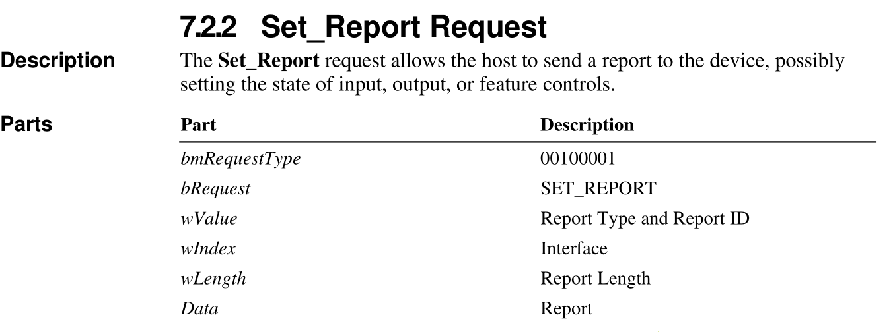
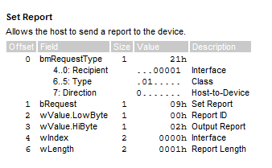
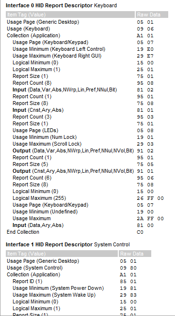
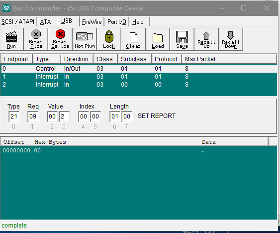
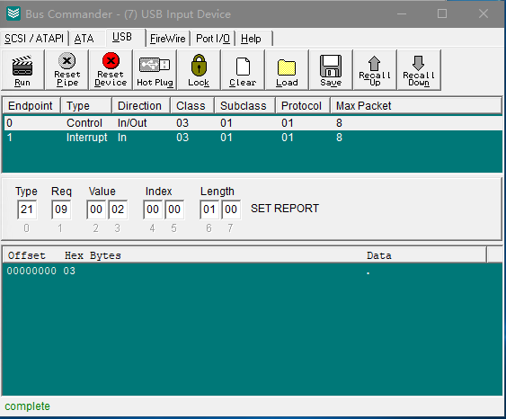
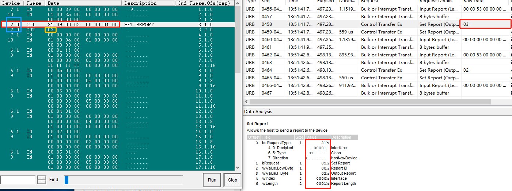

# USB HID Class

[参考文章 usb hid report descriptors](https://eleccelerator.com/tutorial-about-usb-hid-report-descriptors/)

[Device Class Definition for Human Interface Devices(HID)](hid1_11.pdf)

hid report descriptors在usb描述符中的关系


## 标准三键的鼠标


在代码中用数据结构表示如下

	struct mouse_report_t
	{
		uint8_t buttons;
		int8_t x;
		int8_t y;
	}

在hid report descriptors中3个按键描述如下

	USAGE_PAGE (Button)
	USAGE_MINIMUM (Button 1)
	USAGE_MAXIMUM (Button 3)

每个按键用两个值来表示(0和1)

	LOGICAL MINIMUM (0)
	LOGICAL MAXIMUM (1)

总共有3个按键

	REPORT_COUNT (3) # 每个按键时单独上报,需要上报3次按键信息
	REPORT_SIZE (1) # 每次上报的大小为1bit

上报数据描述

	INPUT (Data, Var, Abs)

所以按键的所有描述合起来就是如下

	USAGE_PAGE (Button)
	USAGE_MINIMUM (Button 1)
	USAGE_MAXIMUM (Button 3)
	LOGICAL_MINIMUM (0)
	LOGICAL_MAXIMUM (1)
	REPORT_COUNT (3)
	REPORT_SIZE (1)
	INPUT (Data,Var,Abs)

由于上报数据需要按照8bit对齐,所以剩余的未使用的5bit数据也需要描述

	REPORT_COUNT (1) # 只需要上报一次
	REPORT_SIZE (5) # 一次性上报5bit数据
	INPUT (Cnst,Var,Abs)

x轴的数据上报(y轴同理)

	USAGE_PAGE (Generic Desktop)
	USAGE (X)
	LOGICAL_MINIMUM (-127)
	LOGICAL_MAXIMUM (127)
	REPORT_SIZE (8) # 一次上报8bit数据
	REPORT_COUNT (1) # 上报一次
	INPUT (Data,Var,Rel)

可以将xy轴的数据合并起来表示

	USAGE_PAGE (Generic Desktop)
	USAGE (X)
	USAGE (Y)
	LOGICAL_MINIMUM (-127)
	LOGICAL_MAXIMUM (127)
	REPORT_SIZE (8) # 每次上报8bit数据
	REPORT_COUNT (2) # 需要上报2次
	INPUT (Data,Var,Rel)

按键合xy轴合起来如下

	USAGE_PAGE (Button)
	USAGE_MINIMUM (Button 1)
	USAGE_MAXIMUM (Button 3)
	LOGICAL_MINIMUM (0)
	LOGICAL_MAXIMUM (1)
	REPORT_COUNT (3)
	REPORT_SIZE (1)
	INPUT (Data,Var,Abs)
	REPORT_COUNT (1)
	REPORT_SIZE (5)
	INPUT (Cnst,Var,Abs)
	USAGE_PAGE (Generic Desktop)
	USAGE (X)
	USAGE (Y)
	LOGICAL_MINIMUM (-127)
	LOGICAL_MAXIMUM (127)
	REPORT_SIZE (8)
	REPORT_COUNT (2)
	INPUT (Data,Var,Rel)

还需要添加一些描述信息来表明是鼠标

	USAGE_PAGE (Generic Desktop)
	USAGE (Mouse)
	COLLECTION (Application)
		USAGE (Pointer)
		COLLECTION (Physical)

		... # 将之前的信息填在这里

		END COLLECTION
	END COLLECTION

所以代码中就出现了如下代码(如下代码来源qemu中的dev-hid.c)

	static const uint8_t qemu_mouse_hid_report_descriptor[] = {
		0x05, 0x01,		/* Usage Page (Generic Desktop) */
		0x09, 0x02,		/* Usage (Mouse) */
		0xa1, 0x01,		/* Collection (Application) */
		0x09, 0x01,		/*   Usage (Pointer) */
		0xa1, 0x00,		/*   Collection (Physical) */
		0x05, 0x09,		/*     Usage Page (Button) */
		0x19, 0x01,		/*     Usage Minimum (1) */
		0x29, 0x03,		/*     Usage Maximum (3) */
		0x15, 0x00,		/*     Logical Minimum (0) */
		0x25, 0x01,		/*     Logical Maximum (1) */
		0x95, 0x03,		/*     Report Count (3) */
		0x75, 0x01,		/*     Report Size (1) */
		0x81, 0x02,		/*     Input (Data, Variable, Absolute) */
		0x95, 0x01,		/*     Report Count (1) */
		0x75, 0x05,		/*     Report Size (5) */
		0x81, 0x01,		/*     Input (Constant) */
		0x05, 0x01,		/*     Usage Page (Generic Desktop) */
		0x09, 0x30,		/*     Usage (X) */
		0x09, 0x31,		/*     Usage (Y) */
		0x09, 0x38,		/*     Usage (Wheel) */
		0x15, 0x81,		/*     Logical Minimum (-0x7f) */
		0x25, 0x7f,		/*     Logical Maximum (0x7f) */
		0x75, 0x08,		/*     Report Size (8) */
		0x95, 0x03,		/*     Report Count (3) */
		0x81, 0x06,		/*     Input (Data, Variable, Relative) */
		0xc0,		/*   End Collection */
		0xc0,		/* End Collection */
	}

qemu代码里描述上述鼠标按键的结构时HIDPointerEvent

	typedef struct HIDPointerEvent {
		int32_t xdx, ydy; /* relative iff it's a mouse, otherwise absolute */
		int32_t dz, buttons_state;
	} HIDPointerEvent;

能否让一个鼠标同时支持绝对和相对坐标(通过配置两个report id)

需要在上报的第一个byte里填充report id就能达到效果

	typedef struct HIDPointerEvent {
		int8_t report_id;
		int32_t xdx, ydy; /* relative iff it's a mouse, otherwise absolute */
		int32_t dz, buttons_state;
	} HIDPointerEvent;

在report descriptors中添加report id的描述

	static const uint8_t qemu_mouse_hid_report_descriptor[] = {
		0x05, 0x01,		/* Usage Page (Generic Desktop) */
		0x09, 0x02,		/* Usage (Mouse) */
		0xa1, 0x01,		/* Collection (Application) */
		0x85, 0x01, 	/* report id 1 */
		0x09, 0x01,		/*   Usage (Pointer) */
		0xa1, 0x00,		/*   Collection (Physical) */
		0x05, 0x09,		/*     Usage Page (Button) */
		0x19, 0x01,		/*     Usage Minimum (1) */
		0x29, 0x03,		/*     Usage Maximum (3) */
		0x15, 0x00,		/*     Logical Minimum (0) */
		0x25, 0x01,		/*     Logical Maximum (1) */
		0x95, 0x03,		/*     Report Count (3) */
		0x75, 0x01,		/*     Report Size (1) */
		0x81, 0x02,		/*     Input (Data, Variable, Absolute) */
		0x95, 0x01,		/*     Report Count (1)  未配置button的位也需要上报 */
		0x75, 0x05,		/*     Report Size (5)  一次性将剩余的5bit都上报 */
		0x81, 0x01,		/*     Input (Constant) */
		0x05, 0x01,		/*     Usage Page (Generic Desktop) */
		0x09, 0x30,		/*     Usage (X) */
		0x09, 0x31,		/*     Usage (Y) */
		0x09, 0x38,		/*     Usage (Wheel) */
		0x15, 0x81,		/*     Logical Minimum (-0x7f) */
		0x25, 0x7f,		/*     Logical Maximum (0x7f) */
		0x75, 0x08,		/*     Report Size (8) */
		0x95, 0x03,		/*     Report Count (3) */
		0x81, 0x06,		/*     Input (Data, Variable, Relative) */
		0xc0,		/*   End Collection */
		0xc0,		/* End Collection */
	}


其中格式解读如下(report id可以用一个或多个byte来表示)

	report_tag(1000 01nn) + nbyte_report_id

如果用一个byte表示,则nn = 01, report id tag就是 1000 0101 ==> 0x85

则表示report id 1结果如下

	0x85, 0x01, 	/* report id 1 */

上面的修改只是修改来report descriptors上报数据的格式需要上报report id
,在实际上报的usb数据里也需要修改能上报report id,修改如下

鼠标坐标的处理函数是(hid_pointer_event)

在相对坐标和绝对坐标中分别上报不同的report id(需要和report descriptors一致,将tablet的直接全部拷贝即可)

	hid_pointer_event
		case INPUT_EVENT_KIND_REL:
			e->report_id = 1;
		case INPUT_EVENT_KIND_ABS:
			e->report_id = 2;

在usb写数据到端点时,在最前面的第一个byte填充report id

	hid_pointer_poll
		case HID_MOUSE:
			if (len > l) {
				buf[l++] = e->report_id;
			}

相对鼠标和绝对鼠标report descriptors

	static const uint8_t qemu_mouse_hid_report_descriptor[] = {
		0x05, 0x01,		/* Usage Page (Generic Desktop) */
		0x09, 0x02,		/* Usage (Mouse) */
		0xa1, 0x01,		/* Collection (Application) */
		0x85, 0x01, /* report id 1 */
		0x09, 0x01,		/*   Usage (Pointer) */
		0xa1, 0x00,		/*   Collection (Physical) */
		0x05, 0x09,		/*     Usage Page (Button) */
		0x19, 0x01,		/*     Usage Minimum (1) */
		0x29, 0x03,		/*     Usage Maximum (3) */
		0x15, 0x00,		/*     Logical Minimum (0) */
		0x25, 0x01,		/*     Logical Maximum (1) */
		0x95, 0x03,		/*     Report Count (3) */
		0x75, 0x01,		/*     Report Size (1) */
		0x81, 0x02,		/*     Input (Data, Variable, Absolute) */
		0x95, 0x01,		/*     Report Count (1) */
		0x75, 0x05,		/*     Report Size (5) */
		0x81, 0x01,		/*     Input (Constant) */
		0x05, 0x01,		/*     Usage Page (Generic Desktop) */
		0x09, 0x30,		/*     Usage (X) */
		0x09, 0x31,		/*     Usage (Y) */
		0x09, 0x38,		/*     Usage (Wheel) */
		0x15, 0x81,		/*     Logical Minimum (-0x7f) */
		0x25, 0x7f,		/*     Logical Maximum (0x7f) */
		0x75, 0x08,		/*     Report Size (8) */
		0x95, 0x03,		/*     Report Count (3) */
		0x81, 0x06,		/*     Input (Data, Variable, Relative) */
		0xc0,		/*   End Collection */
		0xc0,		/* End Collection */

		0x05, 0x01,		/* Usage Page (Generic Desktop) */
		0x09, 0x02,		/* Usage (Mouse) */
		0xa1, 0x01,		/* Collection (Application) */
		0x85, 0x02, /* report id 2 */
		0x09, 0x01,		/*   Usage (Pointer) */
		0xa1, 0x00,		/*   Collection (Physical) */
		0x05, 0x09,		/*     Usage Page (Button) */
		0x19, 0x01,		/*     Usage Minimum (1) */
		0x29, 0x03,		/*     Usage Maximum (3) */
		0x15, 0x00,		/*     Logical Minimum (0) */
		0x25, 0x01,		/*     Logical Maximum (1) */
		0x95, 0x03,		/*     Report Count (3) */
		0x75, 0x01,		/*     Report Size (1) */
		0x81, 0x02,		/*     Input (Data, Variable, Absolute) */
		0x95, 0x01,		/*     Report Count (1) */
		0x75, 0x05,		/*     Report Size (5) */
		0x81, 0x01,		/*     Input (Constant) */
		0x05, 0x01,		/*     Usage Page (Generic Desktop) */
		0x09, 0x30,		/*     Usage (X) */
		0x09, 0x31,		/*     Usage (Y) */
		0x15, 0x00,		/*     Logical Minimum (0) */
		0x26, 0xff, 0x7f,	/*     Logical Maximum (0x7fff) */
		0x35, 0x00,		/*     Physical Minimum (0) */
		0x46, 0xff, 0x7f,	/*     Physical Maximum (0x7fff) */
		0x75, 0x10,		/*     Report Size (16) */
		0x95, 0x02,		/*     Report Count (2) */
		0x81, 0x02,		/*     Input (Data, Variable, Absolute) */
		0x05, 0x01,		/*     Usage Page (Generic Desktop) */
		0x09, 0x38,		/*     Usage (Wheel) */
		0x15, 0x81,		/*     Logical Minimum (-0x7f) */
		0x25, 0x7f,		/*     Logical Maximum (0x7f) */
		0x35, 0x00,		/*     Physical Minimum (same as logical) */
		0x45, 0x00,		/*     Physical Maximum (same as logical) */
		0x75, 0x08,		/*     Report Size (8) */
		0x95, 0x01,		/*     Report Count (1) */
		0x81, 0x06,		/*     Input (Data, Variable, Relative) */
		0xc0,		/*   End Collection */
		0xc0,		/* End Collection */
	};

## 标准五键(两个侧键)鼠标

鼠标按键用button1, button2, button3...来命名

qemu代码中用结构体HIDPointerEvent来描述鼠标的数据
typedef struct HIDPointerEvent {
    int32_t xdx, ydy; /* relative iff it's a mouse, otherwise absolute */
    int32_t dz, buttons_state;
} HIDPointerEvent;

其中buttons_state每一位表示按键,这里用int32_t说明可以支持32个按键(一般支持8个按键即可uint8_t)
bit1对应button1, bit2对应button2,以此类推

一般操作系统中将对应按键映射成不同功能

button1:left(鼠标左键)
button2:right(鼠标右键)
button3:middle(滚轮按键)
button4:side(侧边按键1)
button5:extra(侧边按键2)

鼠标设备上报buttonN经过系统映射后变为对应的功能按键(left,right,middle...)

大部分标准5键鼠标都是按照上面的进行映射(button4,button5的映射非强制)

所以在qemu模拟的鼠标中可以将button4和button5和side和extra对应以达到同大部分物理鼠标效果

### 下面以spice-input和USB HID鼠标为例说明

spice捕获坐标后传递给qemu的input子系统来作为鼠标数据提供给虚拟鼠标设备

SpiceInput(spice-input.c)->InputCore(input.c)->USB HID Device(hid.c)

SpiceInput中通过button_mask来传入鼠标按键掩码值
下面代将button4配置为side, button5配置为extra
```c
static void spice_update_buttons(QemuSpicePointer *pointer,
                                 int wheel, uint32_t button_mask)
{
    static uint32_t bmap[INPUT_BUTTON__MAX] = {
        [INPUT_BUTTON_LEFT]        = 0x01, /* button 1 */
        [INPUT_BUTTON_MIDDLE]      = 0x04, /* button 3 */
        [INPUT_BUTTON_RIGHT]       = 0x02, /* button 2 */
        [INPUT_BUTTON_WHEEL_UP]    = 0x40, /* button 7 */
        [INPUT_BUTTON_WHEEL_DOWN]  = 0x80, /* button 8 */
        [INPUT_BUTTON_SIDE]        = 0x08, /* button 4 */
        [INPUT_BUTTON_EXTRA]       = 0x10, /* button 5 */
    };

    if (wheel < 0) {
        button_mask |= 0x40;
    }
    if (wheel > 0) {
        button_mask |= 0x80;
    }
```

qemu中通过文件qapi/ui.json来生成头文件中对应的按键枚举
```c
{ 'enum'  : 'InputButton',
  'data'  : [ 'left', 'middle', 'right', 'wheel-up', 'wheel-down', 'side',
  'extra' ] }

下面是生成的对应的枚举值
typedef enum InputButton {
    INPUT_BUTTON_LEFT = 0,
    INPUT_BUTTON_MIDDLE = 1,
    INPUT_BUTTON_RIGHT = 2,
    INPUT_BUTTON_WHEEL_UP = 3,
    INPUT_BUTTON_WHEEL_DOWN = 4,
    INPUT_BUTTON_SIDE = 5,
    INPUT_BUTTON_EXTRA = 6,
    INPUT_BUTTON__MAX = 7,
} InputButton;
```

SpiceInput调用InputCore的接口最终调入对应的设备模拟设备处理函数,这里假设是HID设备(hid_pointer_event)
```c
static void hid_pointer_event(DeviceState *dev, QemuConsole *src,
                              InputEvent *evt)
{
    static const int bmap[INPUT_BUTTON__MAX] = {
        [INPUT_BUTTON_LEFT]   = 0x01,
        [INPUT_BUTTON_RIGHT]  = 0x02,
        [INPUT_BUTTON_MIDDLE] = 0x04,
        [INPUT_BUTTON_SIDE]        = 0x08,
        [INPUT_BUTTON_EXTRA]       = 0x10,
    };

```

还有一个需要注意的是hid report descriptor
其中下面的配置是同时上报8个按键
```c
static const uint8_t qemu_tablet_hid_report_descriptor[] = {
    0x05, 0x01,		/* Usage Page (Generic Desktop) */
    0x09, 0x02,		/* Usage (Mouse) */
    0xa1, 0x01,		/* Collection (Application) */
    0x09, 0x01,		/*   Usage (Pointer) */
    0xa1, 0x00,		/*   Collection (Physical) */
    0x05, 0x09,		/*     Usage Page (Button) */
    0x19, 0x01,		/*     Usage Minimum (1) */
    0x29, 0x08,		/*     Usage Maximum (8) */
    0x15, 0x00,		/*     Logical Minimum (0) */
    0x25, 0x01,		/*     Logical Maximum (1) */
    0x95, 0x08,		/*     Report Count (8) */
    0x75, 0x01,		/*     Report Size (1) */
    0x81, 0x02,		/*     Input (Data, Variable, Absolute) */
    0x05, 0x01,		/*     Usage Page (Generic Desktop) */
    0x09, 0x30,		/*     Usage (X) */
    0x09, 0x31,		/*     Usage (Y) */
    0x15, 0x00,		/*     Logical Minimum (0) */
    0x26, 0xff, 0x7f,	/*     Logical Maximum (0x7fff) */
    0x35, 0x00,		/*     Physical Minimum (0) */
    0x46, 0xff, 0x7f,	/*     Physical Maximum (0x7fff) */
    0x75, 0x10,		/*     Report Size (16) */
    0x95, 0x02,		/*     Report Count (2) */
    0x81, 0x02,		/*     Input (Data, Variable, Absolute) */
    0x05, 0x01,		/*     Usage Page (Generic Desktop) */
    0x09, 0x38,		/*     Usage (Wheel) */
    0x15, 0x81,		/*     Logical Minimum (-0x7f) */
    0x25, 0x7f,		/*     Logical Maximum (0x7f) */
    0x35, 0x00,		/*     Physical Minimum (same as logical) */
    0x45, 0x00,		/*     Physical Maximum (same as logical) */
    0x75, 0x08,		/*     Report Size (8) */
    0x95, 0x01,		/*     Report Count (1) */
    0x81, 0x06,		/*     Input (Data, Variable, Relative) */
    0xc0,		/*   End Collection */
    0xc0,		/* End Collection */
};

/* HID描述符长度需要对应修改 */
static const USBDescIface desc_iface_tablet = {
...
	/* HID descriptor */
	.data = (uint8_t[]) {
		0x09,          /*  u8  bLength */
		USB_DT_HID,    /*  u8  bDescriptorType */
		0x01, 0x00,    /*  u16 HID_class */
		0x00,          /*  u8  country_code */
		0x01,          /*  u8  num_descriptors */
		USB_DT_REPORT, /*  u8  type: Report */
		sizeof(qemu_tablet_hid_report_descriptor) / sizeof(uint8_t), 0,         /*  u16 len */
	},
...
```

### 调试输入数据

确认SpiceInput输出的数据可以在InputCore中打开调试

	(qemu) trace-event input_event_btn on
	or
	virsh qemu-monitor-command <domain> --hmp trace-event input_event_btn on

确认模拟HID鼠标上报的数据,在下面函数中用gdb打印对应数据

USB数据包的处理函数usb_handle_packet调用流程如下
```c
usb_handle_packet
	usb_hid_handle_data
		hid_pointer_poll

int hid_pointer_poll(HIDState *hs, uint8_t *buf, int len)
    case HID_TABLET:
        if (len > l) {
            buf[l++] = e->buttons_state;
        }
        if (len > l) {
            buf[l++] = dx & 0xff;
        }
        if (len > l) {
            buf[l++] = dx >> 8;
        }
        if (len > l) {
            buf[l++] = dy & 0xff;
        }
        if (len > l) {
            buf[l++] = dy >> 8;
        }
        if (len > l) {
            buf[l++] = dz;
        }
        break;

(gdb) printf "0x%02x, 0x%02x, 0x%02x, 0x%02x, 0x%02x 0x%02x\n", buf[0], buf[1], buf[2], buf[3], buf[4], buf[5]
```
其中使用USBlyzer抓到的raw data区域对应的数据为上面的buf

## How to retrieve the report descriptors in linux

[Ref: get usb report descriptor](https://www.slashdev.ca/2010/05/08/get-usb-report-descriptor-with-linux/)

先确认设备的路径(比如这里的1-8:1.1)

	cat /proc/bus/input/devices

	Sysfs=/devices/pci0000:00/0000:00:14.0/usb1/1-8/1-8:1.1/0003:24AE:1813.0010/input/input40

使用lsusb查看设备的report descriptors显示如下结果

	lsusb -vd 24ae:1813

         Report Descriptors:
			** UNAVAILABLE **

可以先unbind设备再查看

	bash -c "echo -n 1-8:1.1 >/sys/bus/usb/drivers/usbhid/unbind"

	lsusb -vd 24ae:1813

或者在debug目录中查看对应的report descriptors(如果有该文件的话)

	cat /sys/kernel/debug/hid/0003\:24AE\:1813.0010/rdesc

实时查看input event信息(和使用evtest一样)

	cat /sys/kernel/debug/hid/0003\:24AE\:1813.0010/event

## HID set report example(USB 键盘中按下CapsLock,NumLock等LED按键)

HID协议中对set report的定义



下面截图是用USBlyzer抓包的SetReport数据



可以看到该请求是发送给接口0的Set Report请求(class类型的请求,参考HID Class-Specific Requests)

Set Report的参数:Report ID 0, Output Report 2

设备枚举时获取到的HID Report Descriptor截图如下



所以这里的Set Report请求的就是对interface 0中的Output的请求

通过bushound来手动发起这个请求进行测试(发送的数据在最下面设置,这里为0)



修改请求的数据为3



bushound和usblyzer数据同步对比


