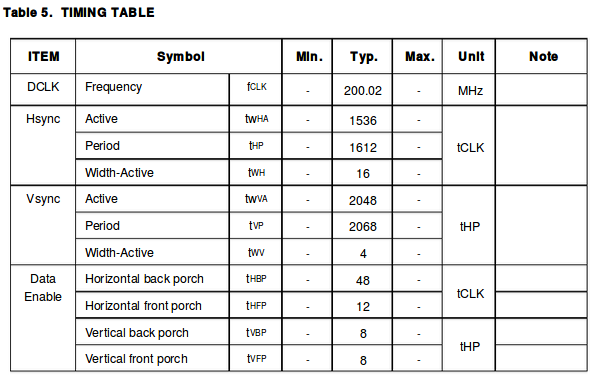

# LCD驱动

## EDP

EDP(LP079QX1)时序如下图

lcd panel在dts中的描述

	panel: panel {
		compatible = "simple-panel";
		backlight = <&backlight>;
		power-supply = <&vcc_lcd>;
		enable-gpios = <&gpio1 13 GPIO_ACTIVE_HIGH>;
		prepare-delay-ms = <20>;
		enable-delay-ms = <20>;

		display-timings {
			native-mode = <&timing0>;

			timing0: timing0 {
				clock-frequency = <200000000>;
				hactive = <1536>;
				vactive = <2048>;
				hfront-porch = <12>;
				hsync-len = <16>;
				hback-porch = <48>;
				vfront-porch = <8>;
				vsync-len = <4>;
				vback-porch = <8>;
				hsync-active = <0>;
				vsync-active = <0>;
				de-active = <0>;
				pixelclk-active = <0>;
			};
		};

		ports {
			panel_in: endpoint {
				remote-endpoint = <&edp_out>;
			};
		};
	};

背光配置

	&backlight {
		status = "okay";
		enable-gpios = <&gpio4 29 GPIO_ACTIVE_HIGH>;
	};

LCD电源配置

	vcc_lcd: vcc-lcd {
		compatible = "regulator-fixed";
		regulator-name = "vcc_lcd";
		gpio = <&gpio4 30 GPIO_ACTIVE_HIGH>;
		startup-delay-us = <20000>;
		enable-active-high;
		regulator-min-microvolt = <3300000>;
		regulator-max-microvolt = <3300000>;
		regulator-boot-on;
		vin-supply = <&vcc5v0_sys>;
	};

### 配置VOPB->eDP->Panel(vopl:ff8f0000, vopb:ff900000)

配置VOPB->eDP

	&edp_in_vopl {
		status = "disabled";
	};

	&edp_in_vopb {
		status = "okay";
	};

	&route_edp {
		connect = <&vopb_out_edp>;
		status = "okay";
	};

配置eDP->Panel

	&edp {
		status = "okay";
		force-hpd;

		ports {
			port@1 {
				reg = <1>;

				edp_out: endpoint {
					remote-endpoint = <&panel_in>;
				};
			};
		};
	};

	panel: panel {
		ports {
			panel_in: endpoint {
				remote-endpoint = <&edp_out>;
			};
		};
	};

### 调试相关

查看当前显示信息

	[root@rk3399:/]# cat /sys/kernel/debug/dri/0/summary
	VOP [ff900000.vop]: ACTIVE
		Connector: eDP
			overlay_mode[0] bus_format[1009] output_mode[f] color_space[0]
		Display mode: 1536x2048p60
			clk[200000] real_clk[200000] type[0] flag[a]
			H: 1536 1548 1564 1612
			V: 2048 2056 2060 2068
		win0-0: ACTIVE
			format: AR24 little-endian (0x34325241) SDR[0] color_space[0]
			csc: y2r[0] r2r[0] r2y[0] csc mode[0]
			zpos: 0
			src: pos[0x0] rect[1536x2048]
			dst: pos[0x0] rect[1536x2048]
			buf[0]: addr: 0x0000000000cdd000 pitch: 6144 offset: 0
		win1-0: DISABLED
		win2-0: DISABLED
		win2-1: DISABLED
		win2-2: DISABLED
		win2-3: DISABLED
		win3-0: DISABLED
		win3-1: DISABLED
		win3-2: DISABLED
		win3-3: DISABLED
		post: sdr2hdr[0] hdr2sdr[0]
		pre : sdr2hdr[0]
		post CSC: r2y[0] y2r[0] CSC mode[1]
	VOP [ff8f0000.vop]: DISABLED
## MIPI

MIPI(sitronix,st7703)

panel和dsi配置

	&dsi {
		status = "okay";

		panel@0 {
			compatible = "sitronix,st7703", "simple-panel-dsi";
			status = "okay";
			reg = <0>;
			backlight = <&backlight>;
			prepare-delay-ms = <2>;
			reset-delay-ms = <1>;
			init-delay-ms = <20>;
			enable-delay-ms = <120>;
			disable-delay-ms = <50>;
			unprepare-delay-ms = <20>;
			enable-gpios = <&gpio1 13 GPIO_ACTIVE_HIGH>;

			width-mm = <68>;
			height-mm = <121>;

			dsi,flags = <(MIPI_DSI_MODE_VIDEO | MIPI_DSI_MODE_VIDEO_BURST |
					  MIPI_DSI_MODE_LPM | MIPI_DSI_MODE_EOT_PACKET)>;
			dsi,format = <MIPI_DSI_FMT_RGB888>;
			dsi,lanes = <4>;

			panel-init-sequence = [
				05 fa 01 11
				39 00 04 b9 f1 12 83
				39 00 1c ba 33 81 05 f9 0e 0e 00 00 00
					 00 00 00 00 00 44 25 00 91 0a
					 00 00 02 4f 01 00 00 37
				15 00 02 b8 25
				39 00 04 bf 02 11 00
				39 00 0b b3 0c 10 0a 50 03 ff 00 00 00
					 00
				39 00 0a c0 73 73 50 50 00 00 08 70 00
				15 00 02 bc 46
				15 00 02 cc 0b
				15 00 02 b4 80
				39 00 04 b2 c8 12 30
				39 00 0f e3 07 07 0b 0b 03 0b 00 00 00
					 00 ff 00 c0 10
				39 00 0d c1 53 00 1e 1e 77 e1 cc dd 67
					 77 33 33
				39 00 07 c6 00 00 ff ff 01 ff
				39 00 03 b5 09 09
				39 00 03 b6 87 95
				39 00 40 e9 c2 10 05 05 10 05 a0 12 31
					 23 3f 81 0a a0 37 18 00 80 01
					 00 00 00 00 80 01 00 00 00 48
					 f8 86 42 08 88 88 80 88 88 88
					 58 f8 87 53 18 88 88 81 88 88
					 88 00 00 00 01 00 00 00 00 00
					 00 00 00 00
				39 00 3e ea 00 1a 00 00 00 00 02 00 00
					 00 00 00 1f 88 81 35 78 88 88
					 85 88 88 88 0f 88 80 24 68 88
					 88 84 88 88 88 23 10 00 00 1c
					 00 00 00 00 00 00 00 00 00 00
					 00 00 00 00 00 30 05 a0 00 00
					 00 00
				39 00 23 e0 00 06 08 2a 31 3f 38 36 07
					 0c 0d 11 13 12 13 11 18 00 06
					 08 2a 31 3f 38 36 07 0c 0d 11
					 13 12 13 11 18
				05 32 01 29
			];

			panel-exit-sequence = [
				05 00 01 28
				05 00 01 10
			];

			display-timings {
				native-mode = <&timing0>;

				timing0: timing0 {
					clock-frequency = <64000000>;
					hactive = <720>;
					vactive = <1280>;
					hfront-porch = <40>;
					hsync-len = <10>;
					hback-porch = <40>;
					vfront-porch = <22>;
					vsync-len = <4>;
					vback-porch = <11>;
					hsync-active = <0>;
					vsync-active = <0>;
					de-active = <0>;
					pixelclk-active = <0>;
				};
			};
		};
	};

### 配置VOPL->DSI->Panel(vopl:ff8f0000, vopb:ff900000)

	&dsi_in_vopl {
		status = "okay";
	};

	&dsi_in_vopb {
		status = "disabled";
	};

	&route_dsi {
		status = "okay";
	};

### 调试相关

查看当前显示信息

	[root@rk3399 ~]# cat /sys/kernel/debug/dri/0/summary
	VOP [ff900000.vop]: DISABLED
	VOP [ff8f0000.vop]: ACTIVE
		Connector: DSI
			overlay_mode[0] bus_format[100a] output_mode[0] color_space[0]
		Display mode: 720x1280p60
			clk[64000] real_clk[64000] type[8] flag[a]
			H: 720 760 770 810
			V: 1280 1302 1306 1317
		win0-0: ACTIVE
			format: XR24 little-endian (0x34325258) SDR[0] color_space[0]
			csc: y2r[0] r2r[0] r2y[0] csc mode[0]
			zpos: 0
			src: pos[0x0] rect[720x1280]
			dst: pos[0x0] rect[720x1280]
			buf[0]: addr: 0x0000000000384000 pitch: 2880 offset: 0
		win2-0: DISABLED
		win2-1: DISABLED
		win2-2: DISABLED
		win2-3: DISABLED
		post: sdr2hdr[0] hdr2sdr[0]
		pre : sdr2hdr[0]
		post CSC: r2y[0] y2r[0] CSC mode[1]
