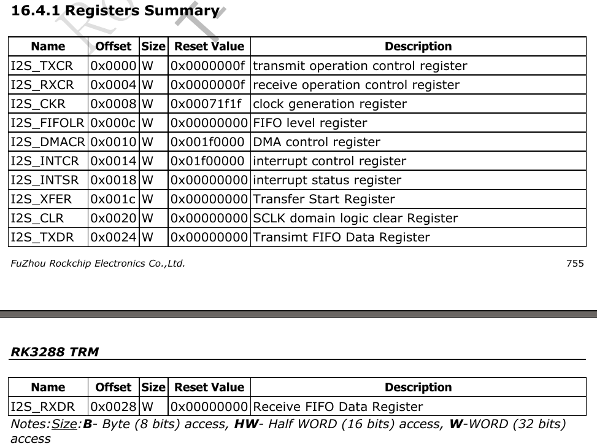

# Codec driver example(es8323/es8316 on rockchip)

## Codec Block Diagram

codec硬件框图如下(ES8323)

### 录音过程(ADC data)

模拟输入从LIN1/RIN1,经过MUX到ADC,通过ASDOUT发送给对端(CPU I2S控制器)

### 放音过程(DAC data)

数字信号从DSDIN进入(对端CPU I2S控制器),发送到DAC,DAC通过DACL/DACR连接到MixL/MixR,最后输出到LOUT1/ROUT1

## 基础知识

参考文章

[Linux ALSA 音频系统:逻辑设备篇](http://blog.csdn.net/zyuanyun/article/details/59180272)

### Frame & Period

+ Sample:样本长度,音频数据最基本的单位,常见的有8位和16位
+ Channel:声道数,分为单声道mono和立体声stereo
+ Frame:帧,构成一个完整的声音单元,所谓的声音单元是指一个采样样本,Frame = Sample * channel
+ Rate:又称 sample rate,采样率,即每秒的采样次数,针对帧而言
+ Period Size:周期,每次硬件中断处理音频数据的帧数,对于音频设备的数据读写,以此为单位
+ Buffer Size:数据缓冲区大小,这里指runtime的buffer size一般来说 buffer_size = period_size * period_count, period_count 相当于处理完一个 buffer 数据所需的硬件中断次数

下面一张图直观的表示buffer/period/frame/sample之间的关系

这个buffer中有4个period,每当DMA搬运完一个period的数据就会出生一次中断,因此搬运这个buffer中的数据将产生4次中断.ALSA 为什么这样做？因为数据缓存区可能很大,一次传输可能会导致不可接受的延迟,为了解决这个问题,alsa 把缓存区拆分成多个周期,以周期为单元传输数据

## Codec驱动(es8323.c)

### 硬件连接

SPK_CTL连接GPIO7_B7

HP_CTL连接GPIO7_A4

HP_DET连接GPIO0_B5

### DeviceTree Describe

	&i2c2 {
	es8323: es8323@10 {
				compatible = "es8323";
				reg = <0x10>;
				spk-con-gpio = <&gpio7 GPIO_B7 GPIO_ACTIVE_HIGH>;
				hp-con-gpio = <&gpio0 GPIO_B5 GPIO_ACTIVE_HIGH>;
				hp-det-gpio = <&gpio7 GPIO_A4 GPIO_ACTIVE_HIGH>;
			};
	};

## Machine驱动(rk_es8323.c rockchip平台)

### DeviceTree Describe

	/ {
		rockchip-es8323 {
			compatible = "rockchip-es8323";
			dais {
				dai0 {
					audio-codec = <&es8323>;
					audio-controller = <&i2s>;
					format = "i2s";
				};
			};
		};
	};

## Platform驱动(rk_i2s.c rockchip平台)

### DeviceTree Describe

	i2s: rockchip-i2s@0xff890000 {
			 compatible = "rockchip-i2s";
			 reg = <0xff890000 0x10000>;
			 i2s-id = <0>;
			 clocks = <&clk_i2s>, <&clk_i2s_out>, <&clk_gates10 8>;
			 clock-names = "i2s_clk","i2s_mclk", "i2s_hclk";
			 interrupts = <GIC_SPI 85 IRQ_TYPE_LEVEL_HIGH>;
			 dmas = <&pdma0 0>, <&pdma0 1>;
			 dma-names = "tx", "rx";
			 pinctrl-names = "default", "sleep";
			 pinctrl-0 = <&i2s_mclk &i2s_sclk &i2s_lrckrx &i2s_lrcktx &i2s_sdi &i2s_sdo0 &i2s_sdo1 &i2s_sdo2 &i2s_sdo3>;
			 pinctrl-1 = <&i2s_gpio>;
		 };

### 从datasheet里Address Mapping可以找到I2S控制器被映射到的位置

### 中断号(SPI[85])

### DMA编号(tx[0], rx[1])

### I2S寄存器信息,32bit,步进4

## Codec驱动(es8316.c)

### 硬件连接(同ES8323)

### DeviceTree Describe

	&i2c2 {
	es8316: es8316@10 {
				compatible = "es8316";
				reg = <0x10>;
				spk-con-gpio = <&gpio7 GPIO_B7 GPIO_ACTIVE_HIGH>;
				hp-con-gpio = <&gpio0 GPIO_B5 GPIO_ACTIVE_HIGH>;
				hp-det-gpio = <&gpio7 GPIO_A4 GPIO_ACTIVE_HIGH>;
			};
	};

## Machine驱动(rk_es8316.c rockchip平台)

### DeviceTree Describe

	/ {
		rockchip-es8316 {
			compatible = "rockchip-es8316";
			dais {
				dai0 {
					audio-codec = <&es8316>;
					audio-controller = <&i2s>;
					format = "i2s";
				};
			};
		};
	};

## Platform驱动(rk_i2s.c rockchip平台, 同ES8323)

## ALSA DAPM

[参考文章:ALSA声卡驱动中的DAPM详解](http://blog.csdn.net/droidphone)

设计dapm的主要目的之一,就是希望声卡上的各种部件的电源按需分配,需要的就上电,不需要的就下电,使得整个音频系统总是处于最小的耗电状态,最主要的就是,这一切对用户空间的应用程序是透明的,也就是说,用户空间的应用程序无需关心那个部件何时需要电源,它只要按需要设定好音频路径,播放音频数,暂停或停止,dapm框架会根据音频路径,完美地对各种部件的电源进行控制,而且精确地按某种顺序进行,防止上下电过程中产生不必要的pop-pop声

### kcontrol

一个kcontrol代表着一个mixer(混音器),或是一个mux(多路开关),或是一个音量控制器等

定义一个kcontrol主要就是定义一个snd_kcontrol_new结构

	struct snd_kcontrol_new {
		...
		snd_kcontrol_get_t *get;
		snd_kcontrol_put_t *put;
		...
		unsigned long private_value;
	};

get回调函数用于获取该控件当前的状态值

put回调函数则用于设置控件的状态值

private_value字段则根据不同的控件类型有不同的意义,比如对于普通的控件,private_value字段可以用来定义该控件所对应的寄存器的地址以及对应的控制位在寄存器中的位置信息

- Mixer控件

Mixer控件用于音频通道的路由控制,由多个输入和一个输出组成,多个输入可以自由地混合在一起,形成混合后的输出

- Mux控件

mux控件与mixer控件类似,也是多个输入端和一个输出端的组合控件,与mixer控件不同的是,mux控件的多个输入端同时只能有一个被选中

- SOC_SINGLE(DAC Stereo Enhancement)

这种控件只有一个控制量,比如一个开关,Codec中某个频率,FIFO大小等

寄存器描述如下

用寄存器0x32偏移量0,最大值7,描述DAC stereo

	SOC_SINGLE("DAC Stereo Enhancement", ES8316_DAC_SET3_REG32, 0, 7, 0),

- SOC_SINGLE_TLV(Mic Boost)

SOC_SINGLE_TLV是SOC_SINGLE的一种扩展,主要用于定义那些有增益控制的控件,例如音量控制器,EQ均衡器等

寄存器描述如下

对应dB数是0.01dB*1200 = 12dB

	static const DECLARE_TLV_DB_SCALE(mic_bst_tlv, 0, 1200, 0);
	SOC_SINGLE_TLV("MIC Boost", ES8316_ADC_D2SEPGA_REG24, 0, 1, 0, mic_bst_tlv),

- Headphone Mixer Mux

硬件框图如下

寄存器描述如下

文字描述

	static const char *const es8316_hpmux_texts[] = {
		"lin1-rin1",
		"lin2-rin2",
		"lin-rin with Boost",
		"lin-rin with Boost and PGA"
	};

取值范围

	static const unsigned int es8316_hpmux_values[] = {0, 1, 2, 3};

用REG13寄存器偏移4位起来控制左通道,最大值7,取值见values数组

	static const struct soc_enum es8316_left_hpmux_enum =
		SOC_VALUE_ENUM_SINGLE(ES8316_HPMIX_SEL_REG13, 4, 7,
					  ARRAY_SIZE(es8316_hpmux_texts),
					  es8316_hpmux_texts,
					  es8316_hpmux_values);

添加到kcontrol

	static const struct snd_kcontrol_new es8316_left_hpmux_controls =
		SOC_DAPM_VALUE_ENUM("Route", es8316_left_hpmux_enum);

用REG13寄存器偏移0位起来控制右通道,最大值7,取值见values数组

	static const struct soc_enum es8316_right_hpmux_enum =
		SOC_VALUE_ENUM_SINGLE(ES8316_HPMIX_SEL_REG13, 0, 7,
					  ARRAY_SIZE(es8316_hpmux_texts),
					  es8316_hpmux_texts,
					  es8316_hpmux_values);

添加到kcontrol

	static const struct snd_kcontrol_new es8316_right_hpmux_controls =
		SOC_DAPM_VALUE_ENUM("Route", es8316_right_hpmux_enum);

将kcontrol添加到dapm widget中,用tinymix可以看到对应的名字

	SND_SOC_DAPM_MUX("Left Hp mux", SND_SOC_NOPM, 0, 0,
			 &es8316_left_hpmux_controls),
	SND_SOC_DAPM_MUX("Right Hp mux", SND_SOC_NOPM, 0, 0,
			 &es8316_right_hpmux_controls),

- Analog Input MUX

硬件框图

寄存器描述

名字

	static const char * const es8316_analog_in_txt[] = {
			"lin1-rin1",
			"lin2-rin2",
			"lin1-rin1 with 20db Boost",
			"lin2-rin2 with 20db Boost"
	};

取值范围

	static const unsigned int es8316_analog_in_values[] = {
			0,/*1,*/
			1,
			2,
			3
	};

用寄存器0x22第4位起控制,最大值3,取值范围见values数组

	static const struct soc_enum es8316_analog_input_enum =
		SOC_VALUE_ENUM_SINGLE(ES8316_ADC_PDN_LINSEL_REG22, 4, 3,
					  ARRAY_SIZE(es8316_analog_in_txt),
					  es8316_analog_in_txt,
					  es8316_analog_in_values);

添加到kcontrol

	static const struct snd_kcontrol_new es8316_analog_in_mux_controls =
		SOC_DAPM_ENUM("Route", es8316_analog_input_enum);

将kcontrol添加到dapm widget中,用tinymix可以看到对应的名字

	SND_SOC_DAPM_MUX("Differential Mux", SND_SOC_NOPM, 0, 0,
			 &es8316_analog_in_mux_controls),

### Widget

所谓widget,其实可以理解为是kcontrol的进一步升级和封装,它同样是指音频系统中的某个部件,比如mixer,mux,输入输出引脚,电源供应器等,用结构体snd_soc_dapm_widget来描述

### Widget之间的连接关系(route)

一个路径的连接至少包含以下几个元素
起始端widget,跳线path,到达端widget,在DAPM中,用snd_soc_dapm_route结构来描述这样一个连接关系

	struct snd_soc_dapm_route {
		const char *sink;
		const char *control;
		const char *source;

		/* Note: currently only supported for links where source is a supply */
		int (*connected)(struct snd_soc_dapm_widget *source,
				 struct snd_soc_dapm_widget *sink);
	};

sink指向到达端widget的名字字符串

source指向起始端widget的名字字符串

control指向负责控制该连接所对应的kcontrol名字字符串

connected回调则定义了自定义连接检查回调函数

该结构的意义是:source通过一个kcontrol,和sink连接在一起,现在是否处于连接状态,请调用connected回调函数检查

有如下route

	static const struct snd_soc_dapm_route es8316_dapm_routes[] = {
		...
		{"Digital Mic Mux", "dmic disable", "Mono ADC"},
		{"Digital Mic Mux", "dmic data at high level", "DMIC"},
		{"Digital Mic Mux", "dmic data at low level", "DMIC"},
		...
	};

从代码中可以知道"Digital Mic Mux"有下面3个输入管脚

	"dmic disable"
	"dmic data at high level"
	"dmic data at low level"

"Mono ADC"连接到"dmic disable"

"DMIC"连接到"dmic data at high level"

"DMIC"连接到"dmic data at low level"

### widget的event回调函数

对于那些位于codec之外的widget,好像喇叭功放,外部的前置放大器等等,由于不是使用codec内部的寄存器进行电源控制,我们就必须利用dapm的事件机制,获得相应的上下电事件,从而可以定制widget自身的电源控制功能

在snd_soc_widget结构有一个event字段用于保存该widget的事件回调函数,同时event_flags字段用于保存该widget需要关心的dapm事件种类,只有event_flags字段中相应的事件位被设置了的事件才会发到event回调函数中进行处理

下面这些widget都是位于codec外部的器件,它们无法使用通用的寄存器操作来控制widget的电源状态,所以需要我们提供event回调函数

	SND_SOC_DAPM_MIC
	SND_SOC_DAPM_HP
	SND_SOC_DAPM_SPK
	SND_SOC_DAPM_LINE

### stream widget

通常是指那些要处理音频流数据的widget

dai widget和stream widget是通过stream name进行匹配的

ES8316代码中的例子

定义I2S输入输出stream name为Capture和Playback的stream widget

	SND_SOC_DAPM_AIF_OUT("I2S OUT", "Capture",  1, ES8316_SDP_ADCFMT_REG0A, 6, 0),
	SND_SOC_DAPM_AIF_IN("I2S IN", "Playback", 0, SND_SOC_NOPM, 0, 0),

对应的dai driver如下

	static struct snd_soc_dai_driver es8316_dai = {
		.name = "ES8316 HiFi",
		.playback = {
			.stream_name = "Playback",
			.channels_min = 1,
			.channels_max = 2,
			.rates = es8316_RATES,
			.formats = es8316_FORMATS,
		},
		.capture = {
			.stream_name = "Capture",
			.channels_min = 1,
			.channels_max = 2,
			.rates = es8316_RATES,
			.formats = es8316_FORMATS,
		},
		.ops = &es8316_ops,
		.symmetric_rates = 1,
	};

### kcontrol 和 DAPM kcontrol

SOC_DAPM_SINGLE对应与普通控件的SOC_SINGLE

SOC_DAPM_SINGLE_TLV对应SOC_SINGLE_TLV等

相比普通的kcontrol控件,dapm的kcontrol控件只是把info,get,put回调函数换掉了

## 如何使用(以ES8323为例)

将es8323.dtsi包含到主dts中

	#include "es8323.dtsi"

加载codec驱动

	insmod es8323.ko

	cat /sys/kernel/debug/asoc/codecs

	内容如下(i2c_driver name.i2c控制器号-I2C设备地址)
	ES8323 codec.2-0010

	cat /sys/kernel/debug/asoc/dais
	ES8323 HiFi

加载platform驱动

	insmod rk_i2s.ko
	cat /sys/kernel/debug/asoc/dais
	内容如下(i2s控制器号地址.dainame)
	ff890000.rockchip-i2s

	cat /sys/kernel/debug/asoc/platforms
	内容如下(i2s控制器号地址.dainame)
	ff890000.rockchip-i2s

加载machine驱动

	insmod rk_es8323.ko 有如下信息表示成功,连接两个个dai
	ES8323 HiFi <-> ff890000.rockchip-i2s mapping ok

所有probe成功后在下面目录会有相关信息

	/dev/snd/
	/proc/asound/cards
	/sys/kernel/debug/asoc/
	/sys/class/sound/

## 测试方法

录音

	tinycap test.wav

播放

	tinyplay test.wav

参数控制(查看所有可调参数)

	tinymix

查看某个参数值

	tinymix <ctrl id>

修改某个参数值

	tinymix <ctrl id> <value>

## 耳机检测

[参考文章Android4.×耳机插拔检测](http://blog.csdn.net/fengying765/article/details/38301483)

[参考文章Android 耳机插拔处理流程](http://blog.csdn.net/xxm282828/article/details/45542039)

### 名词解释

mono 单声道

stereo 立体声

surround 环绕立体声

(audio) jack (音频)插槽,插孔,母头

(audio) plug (音频)插头,子弹头,公头

It features two 3.5mm TRS jacks and one 3.5mm TRRS plug.

It features one TRRS jack and two separate TRS plugs for audio and microphone

headphone 耳机

microphone 麦克风

headset (耳麦)带有麦克风的耳机 headphone + microphone

关于[audio track和channel](https://tutorials.hybrik.com/audio_mapping)

	A media file can have multiple tracks of audio,
	and each track can have 1 or more channels.
	For example, a file might have 2 tracks of audio – one for English and one for Spanish.
	Both of these tracks could be stereo (2 channels),
	or they might both be surround (6 channels), or one of them might be stereo and
	the other surround. There are an enormous number of variations in how audio gets
	mastered, archived, and distributed throughout the video world, and every
	workflow can adopt a different standard. Another example might be two surround
	sound mixes. One company may store that as 12 discrete tracks (1 channel each),
	while another may store it as 2 tracks (6 channels each).

[各种耳机接头TS,TRS,TRRS 参考1](https://www.headphonesty.com/2020/09/use-headphone-jack-microphone)

[各种耳机接头TS,TRS,TRRS 参考2](https://audiouniversityonline.com/ts-vs-trs-vs-trrs-audio-connectors/)

The ‘T’ stands for ‘tip,’ the ‘S’ for ‘sleeve,’ and the ‘R’ for ‘ring

sleeve:地信号

#### TS

TS plug has one tip (T), one sleeve (S) 只有两个连接点的接头,处理单通道音频,比如接吉他等设备

TRS plug consists of one tip (T), a ring (R), and a sleeve (S),三段耳机,有三个接触点
	The tip transmits the left audio output, while the ring transmits the right audio output.

#### TRS

#### TRRS

TRRS plug has one tip (T), two rings (RR), and a sleeve (S) 四段耳机,四个接触点

### 设置android使用InputEvent检测

修改frameworks/base/core/res/res/values/config.xml

	修改为true
	<bool name="config_useDevInputEventForAudioJack">true</bool>

### 驱动中添加相关代码如下

	snd_soc_jack_new(codec, "Headset Jack", SND_JACK_HEADSET, &chip->jack);

	snd_soc_jack_report(&chip->jack, SND_JACK_HEADPHONE, SND_JACK_HEADSET);

### 调试

	adb shell getevent 能够获得插拔耳机的事件

## Attached

### spin lock

[参考文章](http://blog.csdn.net/droidphone/article/details/7395983)

- 如果只是在普通线程之间同时访问共享对象

	使用spin_lock()/spin_unlock()

- 如果是在中断和普通线程之间同时访问共享对象,并且确信退出临界区后要打开中断

	使用spin_lock_irq()/spin_unlock_irq()

- 如果是在中断和普通线程之间同时访问共享对象,并且退出临界区后要保持中断的状态

	使用spin_lock_irqsave()/spin_unlock_irqrestore()

### PCM是什么

[参考文章](http://blog.csdn.net/droidphone/article/details/6308006)

PCM是英文Pulse-code modulation的缩写,中文译名是脉冲编码调制

PCM就是要把声音从模拟转换成数字信号的一种技术

playback:如何把用户空间的应用程序发过来的PCM数据,转化为人耳可以辨别的模拟音频

capture:把mic拾取到得模拟信号,经过采样,量化,转换为PCM信号送回给用户空间的应用程序
