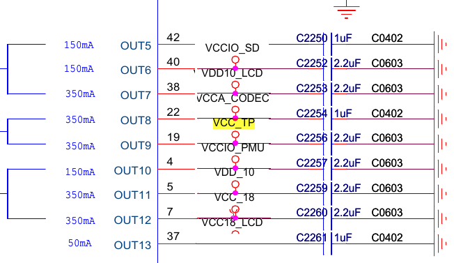

# PlatformDriver

把dtsi文件包含到所使用的dts里

	#include "test_pf.dtsi"

在驱动中如何使用下图中的VCC_TP,详见代码

# show_store_pf.c

	device attr show and store

## usage

把dtsi文件包含到所使用的dts里

	#include "show_store_pf.dtsi"

## debug

输入3个值并查看

	echo 1 3 4 > /sys/devices/my_test_node.23/BBBBB_debug
	cat /sys/devices/my_test_node.23/BBBBB_debug

## SpinLock and Mutex

[locks in linux kernel](./locks.md)
