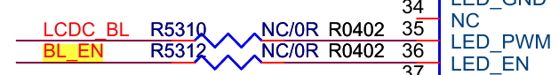

# Linux PWM

[参考文章http://www.wowotech.net/comm/pwm_overview.html?utm_source=tuicool](http://www.wowotech.net/comm/pwm_overview.html?utm_source=tuicool)

# 硬件连接图




PWM引脚功能配置

	#define PWM0 0x7a01
	GPIO7_A0 配置成了PWM功能

	pwm0_pin:pwm0 {
		rockchip,pins = <PWM0>;
		rockchip,pull = <VALUE_PULL_DISABLE>;
		rockchip,drive = <VALUE_DRV_DEFAULT>;
	};

PWM控制器设备树描述

	pwm0: pwm@ff680000 {
		compatible = "rockchip,rk-pwm";
		reg = <0xff680000 0x10>;

		/* used by driver on remotectl'pwm */
		interrupts = <GIC_SPI 78 IRQ_TYPE_LEVEL_HIGH>;
		#pwm-cells = <2>;
		pinctrl-names = "default";
		pinctrl-0 = <&pwm0_pin>;
		clocks = <&clk_gates11 11>;
		clock-names = "pclk_pwm";
		status = "disabled";
	};

背光驱动的设备树描述

	backlight {
		compatible = "pwm-backlight";
		pwms = <&pwm0 0 25000>;
		brightness-levels = <255 254 253 252 251 250 249 248 247 246 245 244 243 242 241 240
			239 238 237 236 235 234 233 232 231 230 229 228 227 226 225 224 223 222 221 220
			219 218 217 216 215 214 213 212 211 210 209 208 207 206 205 204 203 202 201 200
			199 198 197 196 195 194 193 192 191 190 189 188 187 186 185 184 183 182 181 180
			179 178 177 176 175 174 173 172 171 170 169 168 167 166 165 164 163 162 161 160
			159 158 157 156 155 154 153 152 151 150 149 148 147 146 145 144 143 142 141 140
			139 138 137 136 135 134 133 132 131 130 129 128 127 126 125 124 123 122 121 120
			119 118 117 116 115 114 113 112 111 110 109 108 107 106 105 104 103 102 101 100
			99 98 97 96 95 94 93 92 91 90 89 88 87 86 85 84 83 82 81 80 79 78 77 76 75 74 73 72 71 70
			69 68 67 66 65 64 63 62 61 60 59 58 57 56 55 54 53 52 51 50 49 48 47 46 45 44 43 42 41 40
			39 38 37 36 35 34 33 32 31 30 29 28 27 26 25 24 23 22 21 20 19 18 17 16 15 14 13 12 11 10
			9 8 7 6 5 4 3 2 1 0>;
		default-brightness-level = <200>;
		enable-gpios = <&gpio7 GPIO_A2 GPIO_ACTIVE_HIGH>;
	};

# Usage

在主dts文件中包含pwm的dtsi文件

	#include "pwm_backlight.dtsi"

# 测试方法

### 每一秒钟修改一次背光

```shell
# i=0;while (($i < 250)); do echo $i > /sys/devices/backlight.25/backlight/my_backlight/brightness; ((i+=20)); sleep 1;done
```

### 循环修改背光

```shell
# i=0;while (($i < 250)); do echo $i > /sys/devices/backlight.25/backlight/my_backlight/brightness; ((i+=20)); sleep 1;done
# while true; do if (($i > 250)) then;i=0 fi; echo $i; i+=1;done
```

```shell
i=0
while true
do
if(($i > 250)) then
i=0
fi
echo $i > /sys/devices/backlight.25/backlight/my_backlight/brightness;
((i+=10))
sleep 1
done
```
