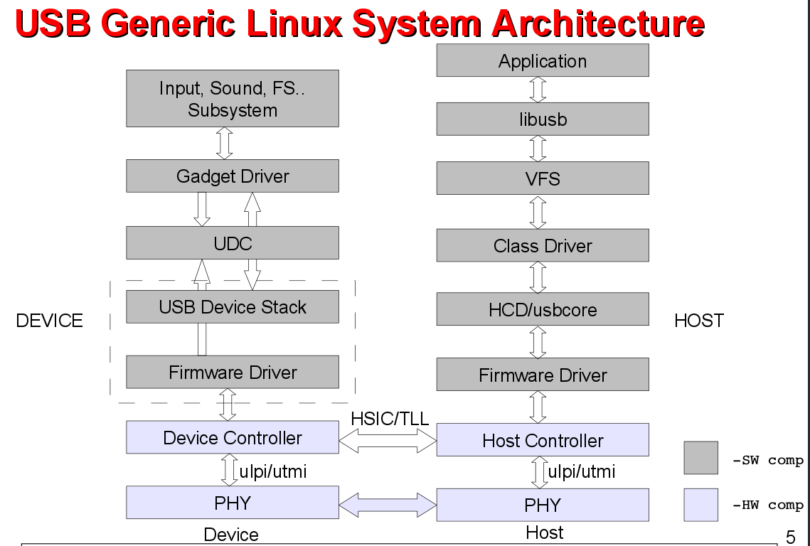
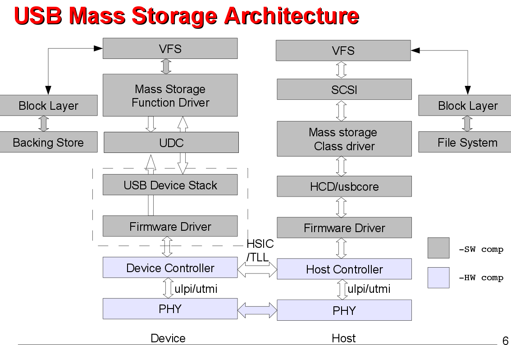
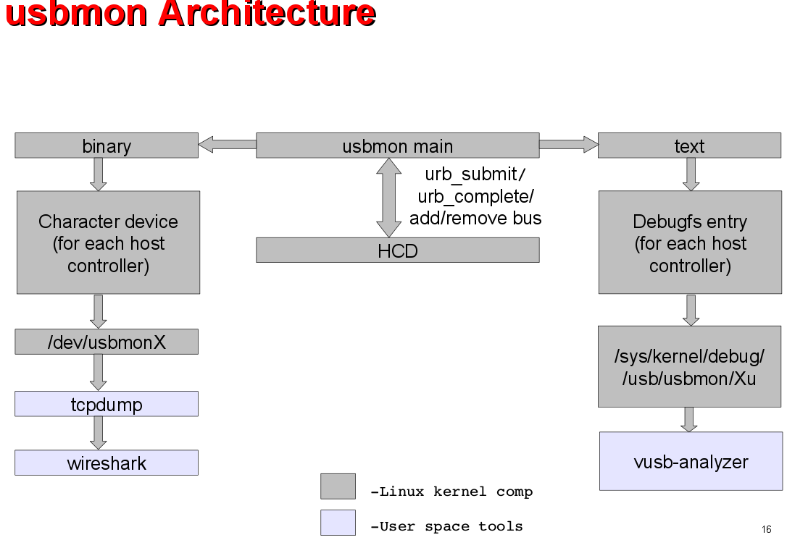
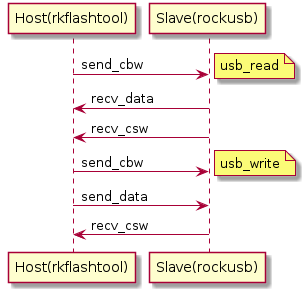

# USB

## USB通信协议基础

[USB通信协议基础](./protocol.md)

[参考文章Linux Core DWC3 User's Guide](http://processors.wiki.ti.com/index.php/Linux_Core_DWC3_User%27s_Guide)

[参考文章Usbgeneralpage](http://processors.wiki.ti.com/index.php/Usbgeneralpage)

## USB在Linux系统中的架构框图





## Host设备在sysfs的信息

下面的是rk3399中的usb信息

	ls /sys/bus/usb/devices/
	1-0:1.0  1-1:1.0  3-0:1.0  5-0:1.0  usb1  usb3  usb5
	1-1      2-0:1.0  4-0:1.0  6-0:1.0  usb2  usb4  usb6

usb1-usb6表示有6个usb控制器

usb设备命名格式如下

	bus-port:config.interface

## Host设备在debugfs的信息

debugfs中信息位置如下

	cat /sys/kernel/debug/usb/devices

## usbmon 架构



### usbmon ASCII capture

编译内核支持usbmon为模块

	mount -t debugfs none_debugfs /sys/kernel/debug
	mdprobe usbmon
	cat /sys/kernel/debug/usbmon/1u > usbmon.mon
	./vusb-analyzer usbmon.mon

### usbmon binary capture

编译内核支持usbmon为模块

	modprobe usbmon

	ls /dev/usbmon*
	/dev/usbmon0  /dev/usbmon1  /dev/usbmon2

	tcpdump -i usbmon1 -w usbmon.pcap &
	./wireshark usbmon.pcap

## Bulk-Only传输协议

设备插入到USB后,USB即对设备进行搜索,并要求设备提供相应的描述符.在USBHost得到上述描述符后,即完成了设备的配置,识别出为Bulk-Only的Mass Storage设备,然后即进入Bulk-Only传输方式
在此方式下,USB与设备间的所有数据均通过Bulk-In和Bulk-Out来进行传输,不再通过控制端点传输任何数据

在这种传输方式下,有三种类型的数据在USB和设备之间传送,CBW、CSW和普通数据.

CBW(Command Block Wrapper,即命令块包)是从USB Host发送到设备的命令, 命令格式遵从接口中的bInterfaceSubClass 所指定的命令块,可以是为SCSI或是自定义传输命令集

USB设备需要将SCSI(自定义的)命令从CBW中提取出来,执行相应的命令,完成以后,向Host发出反映当前命令执行状态的CSW(Command Status Wrapper),Host根据CSW来决定是否继续发送下一个CBW或是数据

Host要求USB设备执行的命令可能为发送数据,则此时需要将特定数据传送出去,完毕后发出CSW,以使Host进行下一步的操作

CBW数据结构如下(kernel/include/linux/usb/storage.h)
```c
/* command block wrapper */
struct bulk_cb_wrap {
	__le32	Signature;		/* Contains 'USBC' */
	u32	Tag;			/* Unique per command id */
	__le32	DataTransferLength;	/* Size of the data */
	u8	Flags;			/* Direction in bit 7 */
	u8	Lun;			/* LUN (normally 0) */
	u8	Length;			/* Of the CDB, <= MAX_COMMAND_SIZE */
	u8	CDB[16];		/* Command Data Block */
};
```

CSW数据结构如下
```c
/* command status wrapper */
struct bulk_cs_wrap {
	__le32	Signature;		/* Should = 'USBS' */
	u32	Tag;			/* Same as original command */
	__le32	Residue;		/* Amount not transferred */
	u8	Status;			/* See below */
};
```

各字段含义

Signature

	固定值: 字符串'USBC'

Tag

	主机发送的一个命令块标识，设备需要原样作为dCSWTag（CSW中的一部分）再发送给Host;主要用于关联CSW到对应的CBW

FLags

	反映数据传输的方向,0表示来自Host, 1表示发至Host

Lun

	 对于有多个LUN逻辑单元的设备,用来选择具体目标.如果没有多个LUN,则写0

Length

	命令的长度,范围在0~16

CDB

	传输的具体命令,符合bInterfaceSubClass中定义的命令规范

Residue

	还需要传送的数据,此数据根据dCBWDataTransferLength本次已经传送的数据得到

Status

	指示命令的执行状态.如果命令正确执行,bCSWStatus返回0 即可

## 应用实例1(USB应用编程)

### 基础概念(核心数据结构)

CBW(Command Block Wrapper)

CDB(Command Data Block)

CSW(Command Status Wrapper)

每一个CBW都对应有一个CSW,且它们的Tag是相同且唯一的

### 情景简介

本应用实例为一个使用usb来传输数据的烧写工具软件rkflashtool

Host端rkflashtool,使用libusb库进行usb通讯

其中CBW中的CDB自定义为相应的命令,详细见代码

Slave端(开发板),进入下载模式后枚举成MassStroage设备,循环等待接收命令,处理命令

### 数据通信流程简图

读流程(usb_read)
- Host发送cbw,其中cdb里包含读命令,Slave解析后返回相应的数据,Slave返回csw

写流程(usb_write)
- Host发送cbw,其中cdb里包含写命令,并发送要写的数据,Slave返回csw

下图中的所有术语是按主机的角度说明的



Libusb编程核心步骤

初始化,设置调试级别,使用vid,pid打开设备,连接设备,获取设备通讯接口,获取描述符

    libusb_init
    libusb_set_debug
	libusb_open_device_with_vid_pid
    libusb_kernel_driver_active
    libusb_claim_interface
    libusb_get_device_descriptor

控制传输接口

	libusb_control_transfer

bulk传输接口

    libusb_bulk_transfer

### 源代码

[HOST端软件代码rkflashtool](https://github.com/54shady/rkflashtool)

[SLAVE端软件代码rockusb](./cmd_rockusb.c)

## 应用实例2(USB设备驱动编程)

需要去掉下面两个配置才能做下面的实验

	CONFIG_USB_HID
	CONFIG_HID_GENERIC

[详细流程见代码注释](./usbmouse_as_key.c)

驱动大致说明如下

使用usb鼠标来模拟一个键盘设备,将鼠标左键定义为按键"L", 鼠标右键定义为按键"S",滚轮按键定义为"Enter"

测试方法1

	hexdump /dev/input/event3 //这里的event3对应我的鼠标设备

测试方法2

	cat /dev/tty1    //按下鼠标左右,和滚轮查看是否有相应字符输出到串口

## Firefly_RK3399 USB

RK3399支持两个Type-C USB3, DP,两个USB2.0 HOST

Type-C0 USB3支持OTG(USB Peripheral和USB HOST)

Type-C1 USB3仅支持USB3 HOST

在Firefly_RK3399上,两路TypeC物理形态如下

Type-C0 USB3设计为Type-C USB3

Type-C1 USB3设计为Type-A USB3 HOST

RK3399DTS的默认配置支持Type-C0 USB3 OTG,Type-C1 USB3 HOST

Type-C0 USB3 OTG(dr_mode = otg)

	usbdrd3_0: usb@fe800000 {
		compatible = "rockchip,rk3399-dwc3";
		clocks = <&cru SCLK_USB3OTG0_REF>, <&cru SCLK_USB3OTG0_SUSPEND>,
			 <&cru ACLK_USB3OTG0>, <&cru ACLK_USB3_GRF>;
		clock-names = "ref_clk", "suspend_clk",
			      "bus_clk", "grf_clk";
		power-domains = <&power RK3399_PD_USB3>;
		resets = <&cru SRST_A_USB3_OTG0>;
		reset-names = "usb3-otg";
		#address-cells = <2>;
		#size-cells = <2>;
		ranges;
		status = "disabled";
		usbdrd_dwc3_0: dwc3@fe800000 {
			compatible = "snps,dwc3";
			reg = <0x0 0xfe800000 0x0 0x100000>;
			interrupts = <GIC_SPI 105 IRQ_TYPE_LEVEL_HIGH 0>;
			dr_mode = "otg";
			phys = <&u2phy0_otg>, <&tcphy0 1>;
			phy-names = "usb2-phy", "usb3-phy";
			phy_type = "utmi_wide";
			snps,dis_enblslpm_quirk;
			snps,dis-u2-freeclk-exists-quirk;
			snps,dis-del-phy-power-chg-quirk;
			snps,xhci-slow-suspend-quirk;
			status = "disabled";
		};
	};

Type-C1 USB3 HOST(dr_mode = host)

	usbdrd3_1: usb@fe900000 {
		compatible = "rockchip,rk3399-dwc3";
		clocks = <&cru SCLK_USB3OTG1_REF>, <&cru SCLK_USB3OTG1_SUSPEND>,
			 <&cru ACLK_USB3OTG1>, <&cru ACLK_USB3_GRF>;
		clock-names = "ref_clk", "suspend_clk",
			      "bus_clk", "grf_clk";
		power-domains = <&power RK3399_PD_USB3>;
		resets = <&cru SRST_A_USB3_OTG1>;
		reset-names = "usb3-otg";
		#address-cells = <2>;
		#size-cells = <2>;
		ranges;
		status = "disabled";
		usbdrd_dwc3_1: dwc3@fe900000 {
			compatible = "snps,dwc3";
			reg = <0x0 0xfe900000 0x0 0x100000>;
			interrupts = <GIC_SPI 110 IRQ_TYPE_LEVEL_HIGH 0>;
			dr_mode = "host";
			phys = <&u2phy1_otg>, <&tcphy1 1>;
			phy-names = "usb2-phy", "usb3-phy";
			phy_type = "utmi_wide";
			snps,dis_enblslpm_quirk;
			snps,dis-u2-freeclk-exists-quirk;
			snps,dis-del-phy-power-chg-quirk;
			snps,xhci-slow-suspend-quirk;
			status = "disabled";
		};
	};
