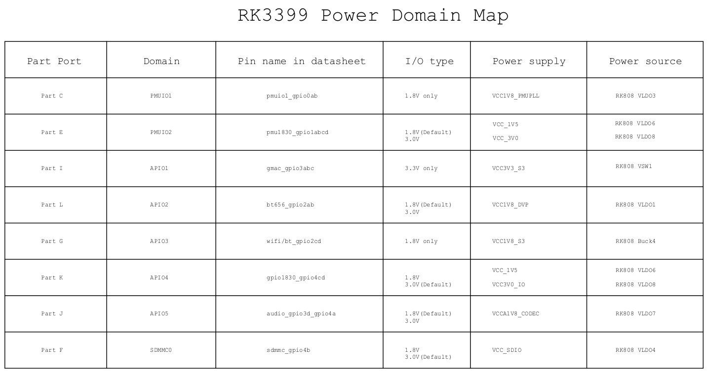
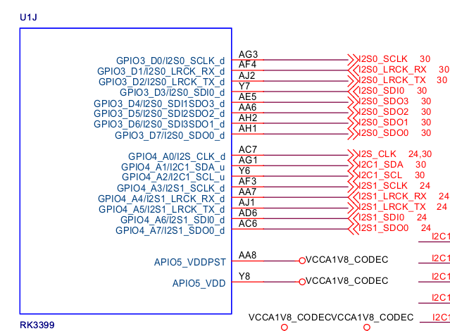

# IO-Domain

RK3399一共有5组GPIO(gpio0~gpio4)

每组gpio都会有不同的电源域,组划分如下(可在RK3399 TRM中找到对应的描述)

- pmuio1_gpio0ab
- pmu1830_gpio1abcd
- gmac_gpio3abc
- bt656_gpio2ab
- wifi/bt_gpio2cd
- gpio1830_gpio4cd
- audio_gpio3d_gpio4a
- sdmmc_gpio4b

## FireflyRK3399开发板情况

下图是Firefly-RK3399开发板的PowerDomainMap

DeviceTree中配置如下

	&io_domains {
		status = "okay";

		bt656-supply = <&vcc1v8_dvp>;       /* bt656_gpio2ab_ms */
		audio-supply = <&vcca1v8_codec>;    /* audio_gpio3d4a_ms */
		sdmmc-supply = <&vcc_sd>;       /* sdmmc_gpio4b_ms */
		gpio1830-supply = <&vcc_3v0>;       /* gpio1833_gpio4cd_ms */
	};

	&pmu_io_domains {
		status = "okay";
		pmu1830-supply = <&vcc_3v0>;
	};

PMU(PMIC)对应的电源节点如下

	vcc1v8_dvp: LDO_REG1 {
		regulator-always-on;
		regulator-boot-on;
		regulator-min-microvolt = <1800000>;
		regulator-max-microvolt = <1800000>;
		regulator-name = "vcc1v8_dvp";
		regulator-state-mem {
			regulator-off-in-suspend;
		};
	};

	vcca1v8_codec: LDO_REG7 {
		regulator-always-on;
		regulator-boot-on;
		regulator-min-microvolt = <1800000>;
		regulator-max-microvolt = <1800000>;
		regulator-name = "vcca1v8_codec";
		regulator-state-mem {
			regulator-off-in-suspend;
		};
	};

	vcc_sd: LDO_REG4 {
		regulator-always-on;
		regulator-boot-on;
		regulator-min-microvolt = <1800000>;
		regulator-max-microvolt = <3000000>;
		regulator-name = "vcc_sd";
		regulator-state-mem {
			regulator-on-in-suspend;
			regulator-suspend-microvolt = <3000000>;
		};
	};

	vcc_3v0: LDO_REG8 {
		regulator-always-on;
		regulator-boot-on;
		regulator-min-microvolt = <3000000>;
		regulator-max-microvolt = <3000000>;
		regulator-name = "vcc_3v0";
		regulator-state-mem {
			regulator-on-in-suspend;
			regulator-suspend-microvolt = <3000000>;
		};
	};

举例说明

APIO5_VDD<-->VCCA1V8_CODEC(VLDO7)

对于没有PMIC的情况

设备树中可以如下配置几个(fixed)固定的regulator

	io-domains {
		status = "okay";
		vccio1-supply = <&vccio_3v3_reg>;
		vccio2-supply = <&vccio_1v8_reg>;
		vccio4-supply = <&vccio_3v3_reg>;
	};

	regulators {
		compatible = "simple-bus";
		#address-cells = <1>;
		#size-cells = <0>;
		vccio_1v8_reg: regulator@0 {
			compatible = "regulator-fixed";
			regulator-name = "vccio_1v8";
			regulator-min-microvolt = <1800000>;
			regulator-max-microvolt = <1800000>;
			regulator-always-on;
		};
		vccio_3v3_reg: regulator@1 {
			compatible = "regulator-fixed";
			regulator-name = "vccio_3v3";
			regulator-min-microvolt = <3300000>;
			regulator-max-microvolt = <3300000>;
			regulator-always-on;
		};
	};
