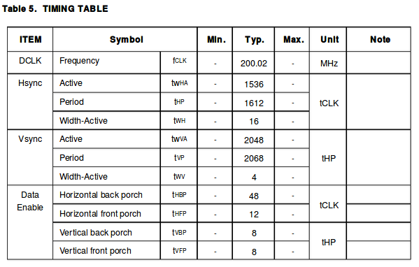

# LCD驱动

## EDP(LP079QX1)

LP079QX1时序如下图

lcd panel在dts中的描述

	panel: panel {
		compatible = "simple-panel";
		backlight = <&backlight>;
		power-supply = <&vcc_lcd>;
		enable-gpios = <&gpio1 13 GPIO_ACTIVE_HIGH>;
		prepare-delay-ms = <20>;
		enable-delay-ms = <20>;

		display-timings {
			native-mode = <&timing0>;

			timing0: timing0 {
				clock-frequency = <200000000>;
				hactive = <1536>;
				vactive = <2048>;
				hfront-porch = <12>;
				hsync-len = <16>;
				hback-porch = <48>;
				vfront-porch = <8>;
				vsync-len = <4>;
				vback-porch = <8>;
				hsync-active = <0>;
				vsync-active = <0>;
				de-active = <0>;
				pixelclk-active = <0>;
			};
		};

		ports {
			panel_in: endpoint {
				remote-endpoint = <&edp_out>;
			};
		};
	};

背光配置

	&backlight {
		status = "okay";
		enable-gpios = <&gpio4 29 GPIO_ACTIVE_HIGH>;
	};

LCD电源配置

	vcc_lcd: vcc-lcd {
		compatible = "regulator-fixed";
		regulator-name = "vcc_lcd";
		gpio = <&gpio4 30 GPIO_ACTIVE_HIGH>;
		startup-delay-us = <20000>;
		enable-active-high;
		regulator-min-microvolt = <3300000>;
		regulator-max-microvolt = <3300000>;
		regulator-boot-on;
		vin-supply = <&vcc5v0_sys>;
	};

## 配置VOPB->eDP->Panel

配置VOPB->eDP

	&edp_in_vopl {
		status = "disabled";
	};

	&edp_in_vopb {
		status = "okay";
	};

	&route_edp {
		connect = <&vopb_out_edp>;
		status = "okay";
	};

配置eDP->Panel

	&edp {
		status = "okay";
		force-hpd;

		ports {
			port@1 {
				reg = <1>;

				edp_out: endpoint {
					remote-endpoint = <&panel_in>;
				};
			};
		};
	};

	panel: panel {
		ports {
			panel_in: endpoint {
				remote-endpoint = <&edp_out>;
			};
		};
	};

## 调试相关

查看当前显示信息

	[root@rk3399:/]# cat /sys/kernel/debug/dri/0/summary
	VOP [ff900000.vop]: ACTIVE
		Connector: eDP
			overlay_mode[0] bus_format[1009] output_mode[f] color_space[0]
		Display mode: 1536x2048p60
			clk[200000] real_clk[200000] type[0] flag[a]
			H: 1536 1548 1564 1612
			V: 2048 2056 2060 2068
		win0-0: ACTIVE
			format: AR24 little-endian (0x34325241) SDR[0] color_space[0]
			csc: y2r[0] r2r[0] r2y[0] csc mode[0]
			zpos: 0
			src: pos[0x0] rect[1536x2048]
			dst: pos[0x0] rect[1536x2048]
			buf[0]: addr: 0x0000000000cdd000 pitch: 6144 offset: 0
		win1-0: DISABLED
		win2-0: DISABLED
		win2-1: DISABLED
		win2-2: DISABLED
		win2-3: DISABLED
		win3-0: DISABLED
		win3-1: DISABLED
		win3-2: DISABLED
		win3-3: DISABLED
		post: sdr2hdr[0] hdr2sdr[0]
		pre : sdr2hdr[0]
		post CSC: r2y[0] y2r[0] CSC mode[1]
	VOP [ff8f0000.vop]: DISABLED
