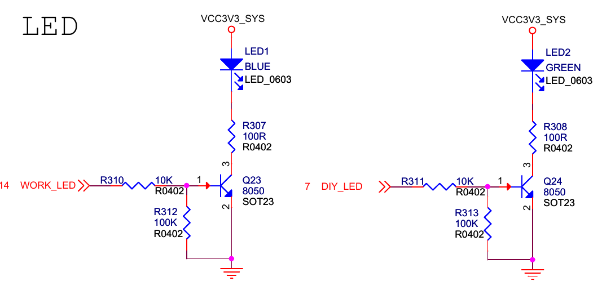

# Uboot

## 在uboot中控制gpio操作led实例



对于上图的Q23三极管,只要拉高WORK_LED管脚,三级管导通,led被点亮

在设备树中leds描述如下

```c
leds {
   compatible = "gpio-leds";
   power {
	   label = "firefly:blue:power";
	   linux,default-trigger = "ir-power-click";
	   default-state = "on";
	   gpios = <&gpio2 D3 GPIO_ACTIVE_HIGH>;
	   pinctrl-names = "default";
	   pinctrl-0 = <&led_power>;
   };
   user {
	   label = "firefly:yellow:user";
	   linux,default-trigger = "ir-user-click";
	   default-state = "off";
	   gpios = <&gpio0 B5 GPIO_ACTIVE_HIGH>;
	   pinctrl-names = "default";
	   pinctrl-0 = <&led_user>;
   };
};
 ```

其中注意两个宏设置,和名字意思相反

	#define GPIO_ACTIVE_HIGH 0
	#define GPIO_ACTIVE_LOW 1

在uboot的板级驱动文件rk33xx.c中添加如下代码,
后在board_late_init函数中调用power_led_init即可

```c
static struct fdt_gpio_state power_led_gpio;
static struct fdt_gpio_state user_led_gpio;
int power_led_parse_dt(const void *blob)
{
	int power_node = 0;
	int user_node = 0;
	int node = 0;

	/* 通过compatible获取leds的node */
	node = fdt_node_offset_by_compatible(blob, 0, "gpio-leds");
	if (node < 0) {
		printf("can't find dts node for led\n");
		return -ENODEV;
	}

	/* 获取leds下power和user的node */
	power_node = fdt_subnode_offset(blob, node, "power");
	user_node = fdt_subnode_offset(blob, node, "user");

	/* 获取power和user里管脚配置 */
	fdtdec_decode_gpio(blob, power_node, "gpios", &power_led_gpio);
	fdtdec_decode_gpio(blob, user_node, "gpios", &user_led_gpio);

	/* 打印出相关信息 */
	printf("power_led_gpio: %s,%d-%d\n", power_led_gpio.name, power_led_gpio.gpio, power_led_gpio.flags);
	printf("user_led_gpio: %s,%d-%d\n", user_led_gpio.name, user_led_gpio.gpio, user_led_gpio.flags);

	return 0;
}

void power_led_init(void)
{
	power_led_parse_dt(gd->fdt_blob);
	if (power_led_gpio.name != NULL)
	{
		/* 由于GPIO_ACTIVE_HIGH宏定义反了,所以这里需要取反flags */
		gpio_direction_output(power_led_gpio.gpio, !power_led_gpio.flags);
		gpio_direction_output(user_led_gpio.gpio, !user_led_gpio.flags);
	}
}
```
