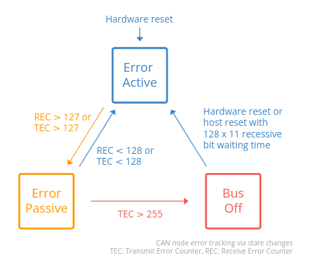

# CAN

## can usage

### test manually

down first

	ip link set can0 down
	ip link set can1 down

setup can

	ip link set can0 type can bitrate 125000
	ip link set can1 type can bitrate 125000
	ip link set can0 up
	ip link set can1 up

receive and send data

	candump can0
	cansend can0 123#1122334455667788

查询can0状态

	ip -details -statistics link show can0

### using can utils to test

[can tutorial](https://sgframework.readthedocs.io/en/latest/cantutorial.html)

产生随机数据并发送到can1总线

	cangen can1 -v

在can1总线上接收数据

	candump -e can1

将数据保存到文件中

	candump -l can1

将日志文件转成可读性好的格式

	log2asc -I candump-2024-07-04_110527.log can1

通过日志来回放can数据传输(默认使用日志中的can1通道)

	canplayer -I candump-2024-07-04_110527.log

使用can0来回放日志中的数据

	canplayer can0=can1 -I candump-2024-07-04_110527.log

## can bus error

[can errors](https://www.csselectronics.com/pages/can-bus-errors-intro-tutorial)

can协议定义的5中错误类型

	Bit Error [Transmitter]
	Bit Stuffing Error [Receiver]
	Form Error [Receiver]
	ACK Error (Acknowledgement) [Transmitter]
	CRC Error (Cyclic Redundancy Check) [Receiver]

CAN 节点状态和错误计数器(TEC, REC)

TEC: Transmitter Error Counter
REC: Receiver Error Counter

can节点状态切换的状态机如下图

- Error Active: This is the default state of every CAN node
- Error Passive: In this state, the CAN node is still able to transmit data, but it now raises 'Passive Error Flags' when detecting errors
- Bus Off: CAN node disconnects

## debug rk3588 can

### 调试系统中can对应关系

rk3588中有3路can,因为目前调试的系统中can0没有使能,所以对应关系变化如下

系统看到信息can1对应代码的can2, can0对应代码的can1

/sys/class/net/can1/device -> ../../../fea70000.can

	can2: can@fea70000 {

/sys/class/net/can0/device -> ../../../fea60000.can

	can1: can@fea60000 {

### 回环测试模式

loop test for can1(不需要外部短接)

	io -4 0xfea70000 0x8415

	candump can1
	cangen can1

work mode for can1(外部将can0和can1短接)

	io -4 0xfea70000 0x8401
	//可能需要重新配置can1, down, up
	candump can1
	cangen can1

## FAQ

issue:
但can连接线断开时，一直发送就会产生如下异常

	write: No buffer space available

[fix: ref link](https://github.com/linux-can/can-utils/issues/262)

	ifconfig can1 txqueuelen 1000
