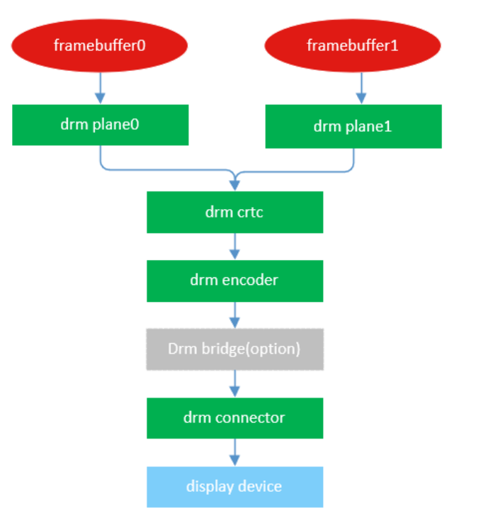
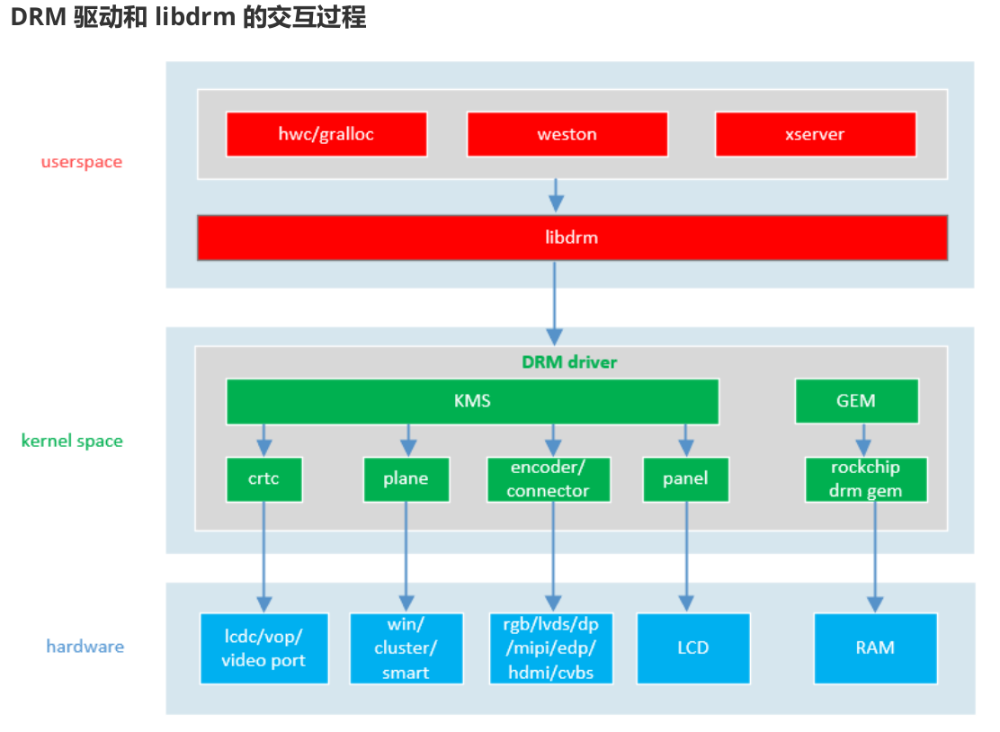

# Display info

接上hdmi前(vp2, connector mipi dis)

	cat /sys/class/drm/card0-DSI-1/status
	connected

	cat /sys/class/drm/card0-HDMI-A-1/status
	disconnected

	cat /sys/kernel/debug/dri/0/summary
	Video Port0: DISABLED
	Video Port1: DISABLED
	Video Port2: ACTIVE
		Connector: DSI-1
			bus_format[100a]: RGB888_1X24
			overlay_mode[0] output_mode[0] color_space[0], eotf:0
		Display mode: 1080x1920p60
			clk[132000] real_clk[132000] type[48] flag[a]
			H: 1080 1095 1099 1129
			V: 1920 1935 1937 1952
		Esmart2-win0: ACTIVE
			win_id: 9
			format: XR24 little-endian (0x34325258) SDR[0] color_space[0] glb_alpha[0xff]
			rotate: xmirror: 0 ymirror: 0 rotate_90: 0 rotate_270: 0
			csc: y2r[0] r2y[0] csc mode[0]
			zpos: 2
			src: pos[0, 0] rect[1080 x 1920]
			dst: pos[0, 0] rect[1080 x 1920]
			buf[0]: addr: 0x0000000000000000 pitch: 4320 offset: 0
	Video Port3: DISABLED

接上hdmi后(vp0, hdmi)

	cat /sys/class/drm/card0-HDMI-A-1/status
	connected

	cat /sys/class/drm/card0-DSI-1/status
	connected

	cat /sys/kernel/debug/dri/0/summary
	Video Port0: ACTIVE
    Connector: HDMI-A-1
        bus_format[100a]: RGB888_1X24
        overlay_mode[0] output_mode[f] color_space[0], eotf:0
    Display mode: 1920x1080p60
        clk[148500] real_clk[148500] type[48] flag[5]
        H: 1920 2008 2052 2200
        V: 1080 1084 1089 1125
    Esmart0-win0: ACTIVE
        win_id: 8
        format: XR24 little-endian (0x34325258) SDR[0] color_space[0] glb_alpha[0xff]
        rotate: xmirror: 0 ymirror: 0 rotate_90: 0 rotate_270: 0
        csc: y2r[0] r2y[0] csc mode[0]
        zpos: 0
        src: pos[0, 0] rect[1920 x 1080]
        dst: pos[0, 0] rect[1920 x 1080]
        buf[0]: addr: 0x0000000000e10000 pitch: 7680 offset: 0
	Video Port1: DISABLED
	Video Port2: DISABLED
	Video Port3: DISABLED

## DRM Card

SOC上的DSS(card0, card1)

	cat /sys/kernel/debug/dri/0/name
	rockchip dev=display-subsystem master=display-subsystem unique=display-subsystem

	/sys/class/drm/card0 -> ../../devices/platform/display-subsystem/drm/card0

对应的render信息

	ls -l /sys/class/drm/renderD128/device/
		driver -> ../../../bus/platform/drivers/rockchip-drm
		of_node -> ../../../firmware/devicetree/base/display-subsystem
		supplier:platform:fdd90000.vop -> ../../virtual/devlink/platform:fdd90000.vop--platform:display-subsystem
		supplier:platform:fde20000.dsi -> ../../virtual/devlink/platform:fde20000.dsi--platform:display-subsystem
		supplier:platform:fde80000.hdmi -> ../../virtual/devlink/platform:fde80000.hdmi--platform:display-subsystem

card0下的四个video port(hardware)

	video_port0
	video_port1
	video_port2
	video_port3

- crtc : 显示控制器

	card0下的四个显示控制器crtc(老版本的说法叫lcdc),是video port的软件抽象

		/sys/kernel/debug/dri/0/crtc-0
		/sys/kernel/debug/dri/0/crtc-1
		/sys/kernel/debug/dri/0/crtc-2
		/sys/kernel/debug/dri/0/crtc-3

- encoder: 指rgb, lvds, dsi, edp, hdmi, vga等显示接口
- connector : encoder和panel之间的接口部分
- panel：泛指屏幕,各种lcd显示设备的软件抽象
- plane : 在rk平台指soc内部vop(lcdc)模块win图层的抽象
- gem : drm下buffer管理和分配,类似ion, dma buffer

NPU Card1

	cat /sys/kernel/debug/dri/1/name
	rknpu dev=fdab0000.npu unique=fdab0000.npu

	/sys/class/drm/card1 -> ../../devices/platform/fdab0000.npu/drm/card1

NPU对应的render信息

	ls -l /sys/class/drm/renderD129/device/

	driver -> ../../../bus/platform/drivers/RKNPU
	iommu -> ../fdab9000.iommu/iommu/fdab9000.iommu
	iommu_group -> ../../../kernel/iommu_groups/0
	of_node -> ../../../firmware/devicetree/base/npu@fdab0000
	subsystem -> ../../../bus/platform
	supplier:i2c:2-0042 -> ../../virtual/devlink/i2c:2-0042--platform:fdab0000.npu
	supplier:platform:fd8d8000.power-management:power-controller -> ../../virtual/devlink/platform:fd8d8000.power-management:power-controller--platform:fdab0000.npu
	supplier:platform:fdab9000.iommu -> ../../virtual/devlink/platform:fdab9000.iommu--platform:fdab0000.npu
	supplier:platform:firmware:scmi -> ../../virtual/devlink/platform:firmware:scmi--platform:fdab0000.npu
	supplier:regulator:regulator.34 -> ../../virtual/devlink/regulator:regulator.34--platform:fdab0000.npu
