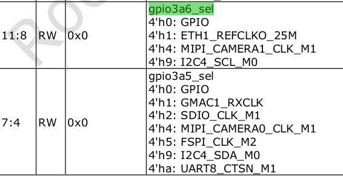

# PinCtrl

引脚复用的配置寄存器在GRF/PMUGRF,rk3588叫做IOC

[RK pinctrl](Rockchip_Developer_Guide_Linux_Pinctrl_CN.pdf)

[RK TRM](Rockchip RK3588 TRM V1.0-Part1-20220309.pdf)

用户太程序依赖CONFIG_ROCKCHIP_IOMUX=y

编译用户空间程序

	export CROSS_COMPILE=~/src/prebuilts/gcc/linux-x86/aarch64/gcc-arm-10.3-2021.07-x86_64-aarch64-none-linux-gnu/bin/aarch64-none-linux-gnu-
	aarch64-none-linux-gnu-gcc ~/src/kernel/linux-5.10/tools/testing/selftests/rkpinctrl/iomux.c -o iomux
	adb push iomux /usr/local/bin/

对于如下i2c4管脚配置

	i2c4 {
		i2c4m0_xfer: i2c4m0-xfer {
			rockchip,pins =
				/* i2c4_scl_m0 */
				<3 RK_PA6 9 &pcfg_pull_none_smt>,
				/* i2c4_sda_m0 */
				<3 RK_PA5 9 &pcfg_pull_none_smt>;
		};

在文档Rockchip RK3588 TRM V1.0-Part1-20220309.pdf中搜索

	gpio3a6_sel
	gpio3a5_sel

通过查看iomux信息来确认是否将mux配置成i2c

	iomux 3 5
	mux get (GPIO3-5) = 9

	iomux 3 6
	mux get (GPIO3-6) = 9

i2c5同理(搜索 gpio3c7_sel gpio3d0_sel)

	iomux 3 23
	mux get (GPIO3-23) = 9

	iomux 3 24
	mux get (GPIO3-24) = 9

	i2c5 {
		i2c5m0_xfer: i2c5m0-xfer {
			rockchip,pins =
				/* i2c5_scl_m0 */
				<3 RK_PC7 9 &pcfg_pull_none_smt>,
				/* i2c5_sda_m0 */
				<3 RK_PD0 9 &pcfg_pull_none_smt>;
		};
