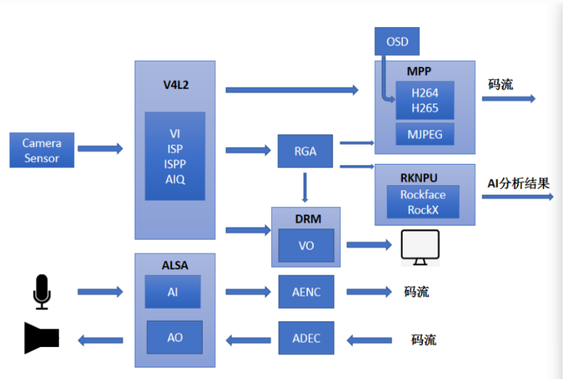

# RGA

[rk rga developer](Rockchip_Developer_Guide_RGA_CN.pdf)

[rk media](https://wiki.t-firefly.com/en/CORE-1109-JD4/Rkmedia.html)

## basic usage

Download code

	git clone https://github.com/airockchip/librga commit fb5f019

Modify(toolchains/toolchain_linux.cmake)

	SET(TOOLCHAIN_HOME "/home/zeroway/src/prebuilts/gcc/linux-x86/aarch64/gcc-arm-10.3-2021.07-x86_64-aarch64-none-linux-gnu")

Compile sample(modify samples/im2d_api_demo/cmake-linux.sh)

	cd samples/im2d_api_demo/
	LIBRGA_PATH=${SAMPLES_DIR}/../libs/Linux/gcc-aarch64/

	./cmake-linux.sh
	cd ../../
	adb push samples/im2d_api_demo/build/build_linux/install/bin/rgaImDemo /data/
	adb push ./samples/sample_file/in0w1280-h720-rgba8888.bin /data/

Run on rk3588 board

	cd /data/
	./rgaImDemo --querystring=all
	./rgaImDemo --flip H

copy the output to x86 host and using yuvview to check

	apt install -y yuview

	adb pull /data/out0w1280-h720-rgba8888.bin

using yuview to check orginnal file

	YUView samples/sample_file/in0w1280-h720-rgba8888.bin
		RAW RGB file
			1280x720
			RGB format : RGB Order : RGB, Bit Depth : 8, Alpha Channel: After RGB data

check output file

	YUView out0w1280-h720-rgba8888.bin

## FAQ

	issue:
		[RKNN] Can not find libdrm.so
	fix:
		ln -s /usr/lib/aarch64-linux-gnu/libdrm.so.2.4.0  /lib/libdrm.so
