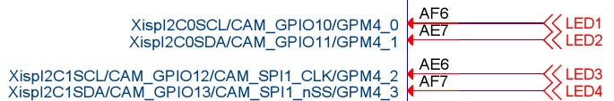
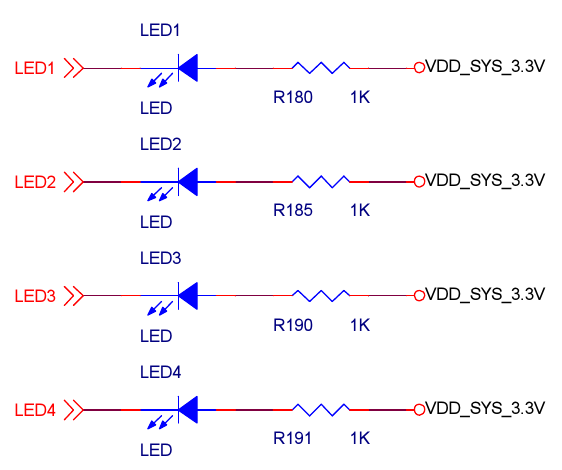
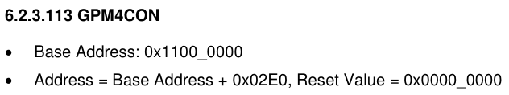
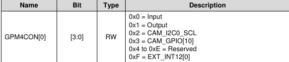

# LED驱动

## 硬件连接

硬件连接如下图,四个LED由GPM4上4个GPIO控制,低电平点亮LED

## 寄存器配置

GPM4的基地址是0x11000000

## 使用方法

在主设备树文件里包含下面的文件

	#include "leds.dtsi"

## 测试

加载驱动后

	cd /sys/bus/platform/drivers/leds/11000000.leds

查看状态

	cat leds

切换到active配置

	echo active > leds

切换到sleep配置

	echo sleep > leds

拉高拉低管脚

	echo 1 > leds
	echo 0 > leds
